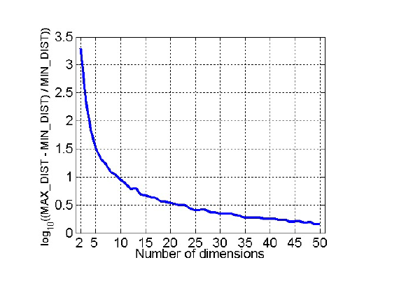

# A Gap Between Intuitive and Data: A Review of Data Mining

$$
\mathbf{\text{Wonjun Park}} \\
\text{Computer Science} \\
\text{University of Texas at Arlington} \\
\text{Arlington, TX, United States} \\
\text{wxp7177@mavs.uta.edu}
$$

##### *Abstract*


$$
\mathbf{\text{Acronym and Abbreviation}} \\
\begin{array}{|c|c|}
\hline
\text{Information Retrieval (IR)} & \text{Term Frequency-Inversed Document Frequency (TF-IDF)} \\
\hline
\text{Knowledge Discovery in Database (KDD)} & \text{Machine Learning (ML)} \\
\hline
\text{Principle Component Analysis (PCA)} & \text{Singular Value Decomposition (SVD)} \\
\hline
\text{Simple Matching Coefficients (SMC)} & \text{Bayesian Belief Networks (BBN)} \\
\hline
\text{} & \text{} \\
\hline
\end{array}
$$

### I. Introduction

### II. Literature Review

#### A. Simpson's Paradox

Simpson's Paradox refers to the result of statistics or probability data is reversed when the whole group of data is divided into several small groups. The situation in UC Berkeley Gender Bias [[1](#mjx-eqn-1)] representatively showed the paradox.

#### B. Definition of keywords in IR Systems

In order to address each language in IR, the common definition of terminologies is required. A **word** is a basic unit of language which the unit is separated by whitespace or punctuation in a text. A **term** is a meaningful unit, indexed and used in an IR system. The difference from **word** is that **term** is the basic units of meaning used to match documents with queries in the system. Additionally, **Term** is often called as normalized **word**. A **token** is a unit of text extracted from a document during the tokenization process. Tokenization is the proceess of breaking text into individual pieces which has multiple options to conduct the process. A **type** refers to the distinct class of tokens in a text. For instance, in the sentence "A dog sat on the mat with another dog", the tokens are ['A', 'dog', 'sat', 'on', 'the', 'mat', 'with', 'another', 'dog'], but the types are ['A', 'dog', 'sat', 'on', the', 'mat', 'with', 'another'], where 'dog' are repeated but only counted once as type. Due to their similarity, **type** and **term** are referred same as in most cases.

In summary, **1)** *word* is a string in a text, **2)** *token* is derived from *word* after tokenization processes which have their own pros and cons, **3)** *type* and *term* are referred to a list grouped the *token*s through the process of normalization under rules such as spelling or morphology. Hence, *Normalization* and *tokenization* are entailed.

**Normalization**

*Normalization* is a step for general cleanup of text, such as removing needless whitespace, lowercasing, and/or removing accenets [[2](#mjx-eqn-2)]. It is important that the *Normalization* step is conducted in IR systems, since users who used a IR system do not consider what they query to the system. For example, U.S.A and USA are different, but the IR system should match those words. Cases like Microsoft Windows and microsoft windows are another example. Typically, IR systems tackle these as removing dots and making all characters lower case. However, words like W.H.O and C.A.T (test) cause an error from the solution since they group with the word 'who' and 'cat' which have totally different meaning. The case of 'Windows' and 'windows' is another error of the solution. These problems lead the IR system to retrieve false positives in its result. Therefore, *Normalization* is crucial since the more IR system normalize *token*s with strict policies, the more its result become inefficient with the result equivalence classes become smaller as well as the less IR system normalize *token*s with loose policies, the less its result become inappropriate too with the number of equivalence classes become bigger.

The process that makes all characters become lowercase is called *Case Folding*. This is the popular preprocessing methods due to the fact that many users do not care about correct capitalization when they query to IR systems. For your information, however, in a few word, capital characters which include crucial meaning are so useful that many deep learning models consider the correct capitalization for their tokens.

**Tokenization**

*Tokenization* indexes the the word in sentence [[2](#mjx-eqn-2)], splitting into what the algorithm of the tokenizer designs. The result become vary depending on what types of tokenizers are used. Each tokenizer adopts different methods to compose their *token*s. For example, in 'Hewlett-Packard', a tokenizer can remove the hypoon, making two seperate tokens. On the other hand, these two seperate words could be interpreted as different meaning such as directing two people, Hwelett and Packard, so that which does IR system use for tokeniers is crucial for its performance. All tokenizers have their own benefits and drawbacks.

The string of numbers is another problem in IR systems. If a string 03201991 is given, what should we determine the type of the string? The string could be a date, March 20th 1991, or a phone number, (032)-019-991. Due to this problem, oldschool IR systems did not utilize the number strings. Yet, Google or recent IR systems process these numbers in their own ways to find relevant matches. (In programming assignment, in order to make the problem simple, we will not use index numbers. Just skip those numerical values.)

"a, an, and, are, at, the, ..." are *stopwords* utilized in sentences regardless of their context. *Stopswords* are usually eliminated during preprocessing steps, for they are mostly meaningless. Nevertheless, the elmination of *Stopwords* should be conducted carefully because they have some meaning sometimes. Take 'King of Denmark' for instance. If the stopword 'of' is removed, the meaning 'Denmark's king', which original word has, becomes ambiguous as 'the name of the king Denmark'. Similar to the string of numbers, the latest web serach engines have indexed these *stopwords* to produce more accurate search. (will not use in assignemnt too)

When it comes to composing equivalence classes for *type* or *term*, *phonetic equivalence* and *semantic equivalence* are needed to be contemplated. *Phonetic equivalence* refers to words which have same sound when we speak. For example, 'Muller' and 'Mueller' are identical. *Semantic equivalence* refers to words which have same meaning like 'car' and 'automobile'. These equivalence are consequently grouped in same classes for them. Two methods are used to address these equivalence; **1)** *Lemmatization* requires a lot of linguistic knowledge since it converts words into their basic form with the grammar rule of the language. For instance, "car, cars, car's, cars'" are translated into 'car', "am, are, is" become 'be', and "The boy's cars are different colors" is transfered to "The boy car be different color". Furthermore, *lemmatization* could be based on inflectional morphology like 'cutting' to 'cut' and derivational morphology such as 'destruction' to 'destroy'. **2)** *Stemming* does not require linguistic knowledge since it just cuts the end of words to only remain what the words principally mean with the hope that the cut will achieve what *lemmatization* achieves. For example, "automate, automatic, automation" are reduced to 'automat'. In other words, *stemming* is achieved as various algorithms which adopt different ways to remain the principal part.

*Porter Algorithm* is the most common algorithm for *stemming* in English. The algorithm is composed by sequential five phases of reductions. Each phase consists of a set of commands. For example, if a sample command were "Delete final 'ement' if what reamins is longer than 1 character", 'replacement' becomes 'replac' and 'cement' becomes 'cement'. If multiple suffixes matched, the longest suffix is prioritized.
(will use library for porter stemmer)

$$
\text{A few rules of Porter Stemmer} \\
\begin{array}{ccc|ccc}
\hline
\bf{\text{Rule}} & & & \bf{\text{Example}} & & \\
\hline
\text{sses} & \to & \text{ss} & \text{caresses} & \to & \text{caress} \\
\text{ies} & \to & \text{i} & \text{ponies} & \to & \text{poni} \\
\text{ss} & \to & \text{ss} & \text{caress} & \to & \text{caress} \\
\text{s} & \to & \text{} & \text{cats} & \to & \text{cat} \\
\hline
\end{array}
$$

*Lovins stemmer* and *Paice stemmer* are another algorithms to conduct *stemming*. Since stemmers are applied to both queries and documents, the lose of the word by stemmers does not matter. The performance is rather improved in most cases. Nevertheless, *Porter Algorithm* contains "operate, operating, operates, operations, ..." which are too broad to implicate in a one class 'oper', resulting in different meaning in the one class like 'operational system' and 'operation' in surgical.

Google, the latest and most advanced search engine, has utilized *stopwords*, *normalization*, *tokenization*, *lowercasing*, *stemming*, non-latin alphabets, umlauts, compunds, *numbers*.

#### C. Ranked Retrieval

The question may arise at this point. "How could we match the query of the user to give results?" If the IR system only took boolean search, this question becomes simple. However, there are two problems: **1)** The most queries from users are not the type of the question answered as yes or no. **2)** Boolean queries often result in either too few (almost zero) or too many (1000s) results. What the IR system needs is the top 10 results which users can focus on their answers.

<!-- 1) and 2) seems to be the same goal. need to check and fix it -->
**Ranked retrieval** gives score based on the similiarity between queries and documents. The score is normally in range 0 to 1. The goal of **Ranked retrieval** is that **1)** the more frequent a query term in the document, the higher score the document get and **2)** the more query terms occur in the document, the higher score the document get. In addition, **3)** the length of the document should be considered in both rules. These three elements derive a conflict so that various algorithms are selected in each optimal situation;

**Jaccard coefficient** is a common value to measure the overlap of two sets. Let $A$ and $B$ are two different sets,

$$
JACCARD(A, B) = {|A \cap B| \over |A \cup B|} \quad ,(A \not = \emptyset \text{ or } B \not = \emptyset) \\
\\
JACCARD(A, A) = 1 \\
JACCARD(A, B) = 0 \text{, if } A \cap B = 0
$$

The sets do not need to be same size. Take query "ideas of March" and Document "Caesar died in March" for example. $JACCARD(q,d)$ is $1 \over 6$. However, Jaccard has three limitations to apply in **Ranked Retrieval**: **1)** It does not consider the frequency of terms. Hinged on basic knowledge, if a query were "CSE student" and documents $d_1$ "CSE at UTA", $d_2$ "CSE CSE at UTA", $d_2$ should be ranked as higher than $d_1$. Nevertheless, they got the same score as $1 \over 4$ in Jaccard, since it is the set operation. **2)** The **Jaccard coefficient** does not handle the important word where important information is implicated. Suppose two queries $q_1$ "CSE student" and $q_2$ "The CSE student". Although the most important word is 'CSE' based on the common knowledge, Jaccard tackle all words as a same weight. The last problem is that **3)** the coefficient does not normalize the length of the document. If the previous example, $d_1$ and $d_2$, had additional words not related with the query which each length is 20 and 1,000, $d_1$ becomes highly ranked than $d_2$ since the denominator of the coefficient are drastically larger.

In order to replace **Jaccard**, three matrix are prioritized to be reviewed;

**1) Binary incidence matrix** shows whether each term is appear in each document or not. For instance, the $\text{Tab. 2}$ shows the appearance of each term in each row.

$$
\text{Table 2. Example of Binary Incidence Matrix} \\
\begin{array}{c|cccccc}
\hline
& \text{Anthony and Cleopatra} & \text{Julius Caesar} & \text{The Tempest} & \text{Hamlet} & \text{Othello} & \text{Macbeth} \\
\hline
\text{ANTHONY} & 1 & 1 & 0 & 0 & 0 & 1 \\
\text{BRUTUS} & 1 & 1 & 0 & 1 & 0 & 0 \\
\text{CAESAR} & 1 & 1 & 0 & 1 & 1 & 1 \\
\text{CALPURNIA} & 0 & 1 & 0 & 0 & 0 & 0 \\
\text{CLEOPATRA} & 1 & 0 & 0 & 0 & 0 & 0 \\
\text{MERCY} & 1 & 0 & 1 & 1 & 1 & 1 \\
\text{WORSER} & 1 & 0 & 1 & 1 & 1 & 0
\end{array}
$$

**2) Count matrix** shows the number of times each terms appears in each document. For instance, the $\text{Tab. 3}$ shows the number of times each term appears in each row.

$$
\text{Table 3. Example of Count Matrix} \\
\begin{array}{c|cccccc}
\hline
& \text{Anthony and Cleopatra} & \text{Julius Caesar} & \text{The Tempest} & \text{Hamlet} & \text{Othello} & \text{Macbeth} \\
\hline
\text{ANTHONY} & 157 & 73 & 0 & 0 & 0 & 0 \\
\text{BRUTUS} & 4 & 157 & 0 & 2 & 0 & 0 \\
\text{CAESAR} & 232 & 227 & 0 & 0 & 0 & 0 \\
\text{CALPURNIA} & 0 & 10 & 0 & 0 & 0 & 0 \\
\text{CLEOPATRA} & 57 & 0 & 0 & 0 & 0 & 0 \\
\text{MERCY} & 2 & 0 & 3 & 8 & 5 & 8 \\
\text{WORSER} & 2 & 0 & 1 & 1 & 1 & 5
\end{array}
$$

For the top of the paper (class), only **bag of words** models are utilized. **Bag of words** refers to, without considering the order in which they appear, the representation of text which describes the presence of words within the text data.

**Term Frequency** $\text{tf}_{t,d}$ is the number of times that the term $t$ appears in the document $d$. However, the $\text{tf}$ alone itself is not enough to understand the importance of the term in the document. For instance, $\text{tf}_{t_1, d} = 10$ does not mean that the $t_1$ is 10 times more important than $t_2$ where $\text{tf}_{t_2, d} = 1$. To solve this problem, **Log Frequency Weighting** was proposed. The log frequency weight $w_{t,d}$ is defined as follows:

$$
\begin{array}{c|cc}
w_{t,d} = & 1 + \log_{10}(\text{tf}_{t,d}) & \text{if } \text{tf}_{t,d} > 0 \\
& 0 & \text{otherwise}
\end{array} \\
\mathbf{\text{NOTICE THAT DEFINING 0 FOR OTERHWISE CASE IS CRITICAL IN ASSIGNEMENTS OR EXAMS}}
$$

With **Log Frequency Weighting**, the **Ranked Retrieval** score, from the previous $\text{tf-matching-scroe}(q, d) = \text{tf}_{t,d}$, $\text{tf-matching-score}(q, d)$ for term $t$ in both query $q$ and document $d$ is calculated as follows:

$$
\text{tf-matching-score}(q, d) = \sum_{t \in q \cap d} w_{t,d} = \sum_{t \in q \cap d} (1 + \log(\text{tf}_{t,d}))
$$

where the score is 0 if the term does not appear in the document.

The score does not have an upper bound unlike the **Jaccard Matching Score** and reflects the frequency of the term in the document. However, the score does not consider the weight of the term such as 'a', 'the', and 'is' which are common among all documents. Rare terms are more informative than common terms so that the score, high weights fore rare terms and low eights for common terms, is required.

**Collection frequency** refers to the total frequency of the term in a collection, a set of all documents. In other words, **collection Frequency** $\text{cf}_t$ is <ins>the number of terms</ins>. The **document frequency** $\text{df}_t$ is <ins>the number of documents</ins> that contain term $t$, a sum of a binary value whether the term is presented in the document or not. With $\text{df}_t$, the **Inverse Document Frequency** $\text{idf}_t$ is calculated as follows:

$$
\text{idf}_t = \log_{10}\left(\frac{N}{\text{df}_t}\right)
$$

where $N$ refers to the number of all documents in the collection. The calculated value $\text{idf}_t$ becomes lower if the term appears in many documents. For example, if a term 'the' appears in all 1,000 documents ($\text{df}_t = 1,000$), the $\text{idf}_t$ is 0.

As a result, with the **Log Frequency Weighting**, the weight of **Term Frequency-Inverse Document Frequency** ($\text{tf-idf}$), a idf weighting, is calculated as follows:

$$
w_{t,d} = (1 + \log_{10}(\text{tf}_{t,d})) \times \log_{10}\left(\frac{N}{\text{df}_t}\right)
$$

Still, the $\text{idf}$ is ineffective for one-term queries.

**3) TF-IDF matrix** shows the $tf-idf$ weights for each term in each document. For instance, the $\text{Tab. 4}$ shows the $tf-idf$ weights for each term in each row.

$$
\text{Table 4. Example of TF-IDF Matrix} \\
\begin{array}{c|cccccc}
\hline
& \text{Anthony and Cleopatra} & \text{Julius Caesar} & \text{The Tempest} & \text{Hamlet} & \text{Othello} & \text{Macbeth} \\
\hline
\text{ANTHONY} & 5.25 & 3.18 & 0 & 0 & 0 & 0.35 \\
\text{BRUTUS} & 1.21 & 6.10 & 0 & 1.0 & 0 & 0 \\
\text{CAESAR} & 8.59 & 2.54 & 0 & 1.51 & 0.25 & 0 \\
\text{CALPURNIA} & 0 & 1.54 & 0 & 0 & 0 & 0 \\
\text{CLEOPATRA} & 2.85 & 0 & 0 & 0 & 0 & 0 \\
\text{MERCY} & 1.51 & 0 & 1.90 & 0.12 & 5.25 & 0.88 \\
\text{WORSER} & 1.37 & 0 & 0.11 & 4.15 & 0.25 & 1.95
\end{array}
$$

The **vector space model** is a model in which each document is represented as a vector in a $N_t$-dimensional space where $N_t$ is **Collection frequency** $\text{cf}_t$. Queries are also represented as vectors in the same space. Whatever preprocessing do in query, do in document is needed. Two perspectives are available to calculate the similarity to between the query and the documents to derive the **Ranked Retrieval** score; **1) Euclidean distance** and **2) Cosine similarity**.

cf. Each term becomes axis of dimensions. If we concatenated two n-dimension vectors, it becomes (n+1)-dimensional vector. For instance, if we concatenate two squares in 2D, it becomes a rectangle in 3D. (IT'S RIGHT. BUT I THINK IT CAN DEPENDS ON WHERE WE CONCATENATE. IF WE CONCATENATE 3-DIMENSIONAL VECTORS IN AXIS 0, IT BECOMES 3-DIMENSIONAL VECTOR BUT IF WE CONCATENATE IN AXIS 1, IT BECOMES 6-DIMENSIONAL VECTOR)

(Skip for the summary of Euclidean distance) However, **1) Euclidean distance** is not suitable for the **Ranked Retrieval** because the distance is not normalized. The distance is affected by the length of the document. For instance, the distance between the query and the document is larger if the document is longer. Using angle instead of distance, **2) Cosine similiarity** is not affected by the length of the document. In other words, the **cosine similarity** is implicated the step of the length normalization which makes a document vector to have a unit vector.

$$
\text{Cosine Similarity} = \frac{\vec{q} \cdot \vec{d}}{||\vec{q}|| \times ||\vec{d}||} \\
\mathbf{\text{ONLY FOR THE UNIT VECTORS}} \text{: } \text{Cosine Similarity} = \vec{q} \cdot \vec{d}
$$

Different weightings for queries and documents are often and expressed as $ddd.qqq$ format. The former $ddd$ refers to the weighting of the document and the latter $qqq$ refers to the weighting of the query. All components of $\text{tf-idf}$ is on the following table.

$$
\text{Table 5. Components of tf-idf} \\
\begin{array}{|c|c|c|}
\hline
\text{Term Frequency tf} & \text{Document Frequency df} & \text{Normalization} \\
\hline
\begin{array}{cc}
\text{n (natural)} & \text{tf}_{t,d} \\
\text{l (logarithmic)} & 1 + \log(\text{tf}_{t,d}) \\
\text{a (augmented)} & 0.5 + 0.5 \times \frac{\text{tf}_{t,d}}{\max_{t' \in d} \text{tf}_{t',d}} \\
\text{b (boolean)} & 1 \text{, if } \text{tf}_{t,d} > 0 \text{, otherwise 0} \\
\text{L (log average)} & {1 + \log{\text{tf}_{t,d}} \over {1 + \log{(ave_{t' \in d} \text{tf}_{t',d})}} \\}
\end{array} &
\begin{array}{cc}
\text{n (no)} & 1 \\
\text{t (idf)} & \log{N \over \text{df}_t} \\
\text{p (prob idf)} & max(0, \log{N - \text{df}_t \over \text{df}_t}) \\
\end{array} &
\begin{array}{cc}
\text{n (none)} & 1 \\
\text{c (cosine)} & 1 \over {\sqrt{w_1^2 + w_2^2 + \cdots + w_M^2}} \\
\text{u (pivoted unique)} & 1 \over u \\
\text{b (byte size)} & {1 \over \text{CharLength}^a}, a < 1
\end{array} \\
\hline
\end{array}
$$

For example, 'lnc.ltn' means that document is 1) logarithmic $\text{tf}$, 2) no $\text{df}$ weighting, and 3) cosine normalization, and query is 1) logarithmic $\text{tf}$, 2) logarithmic ($\text{i}$)$\text{df}$, and 3) no normalization. Sometimes, not using $\text{idf}$ in documents is not bad for the performance of IR systems.

In conclusion, reviewing three types of matrixs and **vector space model**, IR systems return the top K, like 10, documents which have the highest scores to the users.

#### D. Data Mining

The four Vs in Big Data define what Big Data is. **1) Volume** refers to the size of the datasets. Most U.S. companies have more than 100 terabytes of data, 40 Zettbytes of data are expected to be generated in a year by 2020. In order to process the sheer volume of the data, distinct and different technologies than traditional ones is required. **2) Variety** is the types of data. Importantly, the data is classified into three types; **Structured data**, **Semi-structured data**, and **Unstructured data**. **Structured data** is the data which is organized in a tabular format, like relational database tables and CSV/TSV files. **Semi-structured data** is the data which is not organized in a tabular format but has some organizational properties, like XML, JSON, and RDF. **Unstructured data** is the data which is not organized in a tabular format and does not have any organizational properties, like text data, videos, audio, and binary data files. As of 2011, the global healthcare data was estimated to be 150 exabytes and, by 2020, 420 million wearable and wireless health monitors were expected to be use.  **3) Velocity** is the speed of the data. The data is generated faster than every before. For instance, the data from the New York Stock Exchange is generated in terabytes every day and more than 4 billion hours of video were watched on YouTube every month. **4) Veracity** is the quality of the data. The data is often dirty, incomplete, and inconsistent which makes it difficult to trust the data since data quickly becomes outdated and information shared via the Internet and social media does not necessarily have to be correct.

A lot of datasets such as Amazon Public Data Sets and Data.gov are available. More information is on the lecture note page 11-13.

**Data Mining** is the extraction of interesting patterns or knowledge from huge amount of data. Retreving data and addressing not interesting data such as trivial, explicit, known, and useless are not the purpose of data mining. Marketing, retail, banking, medicine, and fraud detection are the fields where data mining is utilized.

**KDD** process is a classic process in data mining, discovering useful knowledge from large volumes of data. The process involves several stages where the transition to any other stages is allowed in each stage:

$$
\text{Data} \quad \underrightarrow{\text{Selection}} \quad \text{Target Data} \quad \underrightarrow{\text{Preprocessing}} \quad\ \text{Preprocessed Data} \quad \underrightarrow{\text{Trnasformation}} \quad \text{Transformed Data} \\
\underrightarrow{\text{Data Mining}} \quad \text{Patterns} \quad \underrightarrow{\text{Interpretation / Evaluation}} \quad \text{Knowledge}
$$

Typically, pattern discovery, association and correlation, classification, clustering, outlier analysis are the tasks in **data mining** from the perspective from ML and statistics. The pattern discovery is the task to find patterns in the data. The classification is the task to classify data into different classes. The clustering is the task to group data into clusters. The association rule mining is the task to find rules that describe the relationship between items in the data. The outlier detection is the task to find data that is significantly different from the rest of the data.

A lot of data mining software are summarized in the lecture note page 19.

#### E. Data and Data Preprocessing

**Data** is the raw material, a collection of facts, figures, and statistics that can be processed to produce information. In structed data, data is a collection of objects and their attributes. An object is a row of a table in structed data, and an attribute is a column of a table, a property or characteristic of an object.

Attributes can be different types, such as numbers, text, dates, etc. For example, in a table of students, the attributes would have attributes like studnet ID as a number, student name as text. Same values in different attributes normally have different meanings. Take student ID and age as an example. A student who is 20 years old can get a student ID of 20, but the two 20s have different meanings. A same attribute can also have different values. Height is measured as feet and inches, resulting in two values for the same attribute.

By the measurement scale, attributes are classified into four types: nominal, ordinal, interval, and ratio. These attributes hierarchically have different properties; nominal $\subset$ ordinal $\subset$ interval $\subset$ ratio. **1) Nominal attributes** refers to the type of attributes that have *distinctness* properties, compared by $=, \not=$. For example, eye color is a nominal attribute as well as student ID is a nominal attribute in terms of it is unique to each student. **2) Ordinal attributes** have *order* properties, represented as <, >. Rankings, such as student grade, satisfaction level, and height are ordinal attributes. **3) Interval attributes** have the *difference (addition)* property, written as $+, -$, which differences between values are meaningful. For instance, temperature in Celsius or Fahrenheit is an interval attribute and dates on calendar are interval attributes. **4) Ratio attributes** have the properties of nominal, ordinal, and interval attributes as well as *multiplication and division ($\times$, $\div$)* are meaningful. For example, temperature in Kelvin is a ratio attribute, and height is a ratio attribute.

For more details of the temperature, Kelvin starts at absolute zero, causing the ratio between two Kelvin values to be meaningful. 300$K$ is twice as hot as 150$K$. However, Celsius and Fahrenheit do not have an absolute zero, so the ratio between two Celsius or Fahrenheit values is not meaningful. 40$^{\circ}C$ is not twice as hot as 20$^{\circ}C$ as well as Fahrenheit.

By the number of values, attributes are classified into two types: discrete and continuous. **1)** Discrete attributes have a finite number of values, such as zip codes, counts, or the set of words in a collection of documents. They are often represented as integers. **2)** Continuous attributes have an infinite number of values, such as temperature, height, and weight. Real values are only measured from these attributes and are often represented as floating-point numbers.

"""
Important Characteristics of Structed Data
1. Dimensionality - the number of attributes in the data. High-dimensional data is a large number of attributes and is complex to analyze and visualize. The problem, known as the curse of dimensionality, occurs when the number of attributes is too large.
2. Sparsity - the percentage of zero values in the data. Sparse data has a large number of zero values, causing a problem in data analysis and data mining.
3. Resolution - the scale of the data, composing patterns. In other words, the resolution of the data is the level of detail in the data.
"""

Three types of datasets were reviewed; **1) Record data** is the most common type of data, which is a collection of records, each of which consists of a fixed set of attributes. A **data matrix** is a two-dimensional data matrix, where rows represent records and columns represent attributes. Data objects which have the same fixed set of numeric attributes are represented as a multi-dimensional vector, shown as the two-dimensional table. **Document data** is a collection of text documents, where each document becomes a term vector. The value in the each vector corresponds the occurence of the term in the document. **Transaction data** is a special type of record data, where each record (transaction) involves a transaction, such as a purchase, a bank transaction, or a call record.

**2) Graph data** is a collection of nodes and edges, where nodes represent entities and edges represent relationships between entities. **World Wide Web** is a graph data, where web pages are nodes and hyperlinks are edges. **Molecular (chemical) structures** are also graph data, where atoms are nodes and bonds are edges. **3) Ordered data** is a collection of sequences, where the order of data objects is important. **Genomic sequence data** is an example of ordered data, where the order of nucleotides is critical. **Spatio-temporal data** is also ordered data which includes both space and time information.

**Data Quality** is an important issue in data mining, as the quality of data affects the quality of the results. Data quality issues include noise, outliers, missing values, and duplicate data. **1)** Noise is a unwanted data, a random error or variance during a mesurements, causing the modification of original data. **2)** Outliers are data objects significantly different from the rest of the data, produced by errors in data collection or data processing. **3)** Missing values are data objects with missing attribute values. Missing values are addressed by removing the data objects with missing values, estimating the missing values as a global constant, an attribute mean, or a learning algorithm that can estimate missing values, ignoring the missing values during data analysis. **4)** Duplicate data are data objects that are duplicates of other data objects moajorly emerged during merging data from heterogeneous sources. Data cleaning, a process of removing duplicated objects, is conducted to erase the duplicates.

**Data Preprocessing** is a process of converting raw data into an required format. Data preprocessing contains **aggregation, sampling, dimensionality reduction, feature subset selection, feature creation, discretization and binarization**, and **attribute transformation**. **Aggregation** is a process of combining two or more attributes into a single attribute, changing the scale of the data like from daily data to monthly data. The volume of data is reduced, resulting in a more stable and less variability data. **Sampling** is a process of selecting a subset of an original dataset, employed to reduce the data size and the cost of data analysis. Since the entire dataset is generally too large and expensive (regarding both time and money) to analyze and process, sampling becomes a solution to the problem. Furthermore, on the other side of the down-sampling, upsampling is also conducted to increase the size of the dataset when the dataset is too small. The key principle of sampling is that the subset made by sampling should have same properties as the original dataset.

Four types of sampling are introduced; **1) Random sampling** is a process that selects data objects with an equal probability. **2) Without replacement sampling** is a process that removes the selected data object from the population. **3) With replacement sampling** is a process that does not remove the selected data object from the population. **4) Stratified sampling** is a process that divides the population into subpopulations and then selects data objects from each subpopulation so that the sampled dataset is ensured to have the same distribution as the original dataset.

**Sample size** is a matter of concern in sampling, since if the sample size is too small, the sample may not represent the pattern of the population, and if the sample size is too large, the sample may be redundant. For instance, if the number of classes is 10, the sample size should be at least 10 to select all classes due to pigeonhole principle.

**Dimensionality Reduction** is a process of reducing the number of attributes in the data. Curse of dimensionality occurs when the number of attributes is too large, causing the complexity of data analysis and visualization. According to the plot in $\text{Fig. 1}$ below, the variation of the data is decreased as the number of attributes increases. To solve the problem, PCA, SVD, and other dimensionality reduction techniques like supervised or non-linear dimensionality reduction are employed. PCA is a technique that transforms the data into a new coordinate system, where the new axes are the principal components of the data. In other terms, the eigenvectors of the covariance matrix are the new axes derived from PCA.

 \
$\text{Fig. 1. Plot of the curse of dimensionality}$ [[3](#mjx-eqn-3)]

**Feature Subset Selection** is another way to reduce dimensionality. Four techniques, brute-force, embedded, filter, and wrapper, are utilized. Brute-force is a technique that tries all possible subsets of attributes and selects the best subset. Embedded is a technique that naturally selects as the part of the data mining algorithm. Filter is a technique that selects before the data mining algorithm is applied. Wrapper is a technique that uses the data mining algorithm as a black box to find the best subset of attributes.

**Feature Creation** is a process of creating new attributes from the original attributes to capture the crucial patterns much more efficiently than the original attributes. For example, if the original attributes are height and weight, the new attribute, BMI, can be created by the formula $\text{BMI} = \frac{\text{weight}}{\text{height}^2}$. Three approaches are employed to create new attributes; **1)** Feature extraction with domain-specific knowledge, **2)** Mapping the data into a new space, and **3)** Feature construction by combining the original attributes. In addition to the BMI example above, the signal combination with Fourier Transform or Wavelet Transform is another example of feature creation.

**Discretization (Binarization)** is a process of converting continuous attributes into discrete attributes. **1)** Entropy-based discretization is a supervised technique that divides the data into manually defined intervals, labeling the data with the interval. **2)** Unsupervised discretization is a technique that divides the data into intervals without class labels. Equal interval width, equal frequency, and clustering are the three techniques of unsupervised discretization.

**Attribute Transformation** is a process to transform or to scale the data into a new form with functions like $x^k, \log(x), \exp(x), \sin(x), \|x\|, \text{etc.}$. Standardization and normalization are also employed to convert the data into a new form.

#### F. Similarity and Distance Measures

Similarity and dissimilarity (distance) are numerical measures of how alike or different two data objects are. Similarity is often normalized as [0, 1], while dissimilarity often has minimum value 0 and no uppber bound.

When $p$ and $q$ are attribute values of two data objects, simple methods for calculating similarity and dissimilarity are as follows:

$$
\begin{array}{|c|c|c|}
\hdashline
\text{Attribute} & \text{Similarity} & \text{Dissimilarity} \\
\hline
\text{Nominal} & s = \begin{cases} 1 & \text{if } p = q \\ 0 & \text{if } p \neq q \end{cases} & d = \begin{cases} 0 & \text{if } p = q \\ 1 & \text{if } p \neq q \end{cases} \\
\text{Ordinal} & s = 1 - \frac{|p - q|}{n - 1} \; (s = 1-d) & d = \frac{|p - q|}{n - 1} \\
& (\text{where } n \text{ is the number of values, mapping the values to integers 0 to n-1}) \\
\hline
\text{Interval or Ratio} & s = -d, s = \frac{1}{1+d} & d = |p - q| \\
\hline
\end{array}
$$

The **Euclidean distance**, a specific case of **Minkowski Distance**, is commonly a measure of **dissimilarity** between two point $p$ and $q$.

$$
\text{dist} = \left( \sum_{i=1}^{n} |p_i - q_i|^r \right)^{1/r} \begin{cases} r = 1, & \text{Manhattan distance, L1 norm} \\ r = 2, & \text{Euclidean distance, L2 norm} \\ r = \infty, & \text{Supremum (Chebyshev) distance, L}_\text{max}\text{ norm, L}_\infty\text{ norm} \end{cases}
$$

where $r$ is the dimension of the distance and $n$ is the number of attributes. In most cases, since the scale of each attribute is different, the standardization is necessary. The standardization is processed by subttracting the mean and dividing by the standard deviation or by scaling the values to [0, 1] by the formula $\frac{ \text{target}_{d} - \text{min}_{d_i} }{ \text{max}_{d_i} - \text{min}_{d_i} }$

For Supremum distance $L_\text{max}$ or $L_\infty$ norm, the distance converges to the maximum difference among attributes from the two vectors.

These distances have the following well-known properties which a distance that satisfies these properties is called a metric; \
$\quad\text{1.}$ $d(p, q) \geq 0$ : Positive definiteness for all $p$ and $q$. 0 only if $p = q$. \
$\quad\text{2.}$ $d(p, q) = d(q, p)$ : Symmetry for all $p$ and $q$. \
$\quad\text{3.}$ $d(p, q) + d(q, r) \geq d(p, r)$ : Triangle Inequality for all points $p, q, r$.

**Similarity** also have common properties, \
$\quad\text{1.}$ $s(p, q) = 1 \text{ only if } p = q$ : Identity. (1 or the maximum similarity value) \
$\quad\text{2.}$ $s(p, q) = s(q, p)$ : Symmetry  for all $p$ and $q$

Between binary vectors, the **1) SMC (Simple Matching Coefficient)** and **2) Jaccard Coefficient** are normal measures of similarity. The SMC is the proportion of matching attributes to the total number of attributes. Specifically, when

$$
\begin{array}{c|c|c}
& \text{SMC} & \text{Jaccard Coefficient} \\
\hline
M_{pq} = \begin{cases} M_{01} \quad p=0, q=1 \\ M_{10} \quad p=1, q=0 \\ M_{11} \quad p=1, q=1 \\ M_{00} \quad p=0, q=0 \end{cases} & \frac{M_{11} + M_{00}}{M_{11} + M_{00} + M_{10} + M_{01}} & \frac{M_{11}}{M_{11} + M_{10} + M_{01}} \\
(\text{The number of attributes for each case } p \text{ and } q) \\
\hline
\text{ex. } p = \text{1 0 0 0 0 0 0 0 0 0, }q = \text{0 0 0 0 0 0 1 0 0 1} & \frac{0 + 7}{0 + 7 + 1 + 2} = \frac{7}{10} & \frac{0}{0 + 1 + 2} = 0
\end{array}
$$

These two coefficient differ in the precense of $M_{00}$ value, giving different results. Consequently, each coefficient is suitable for different cases. **SMC** is better when $M_{00}$ has an important meaning to translate the similarity. **Jaccard Coefficient** is more suitable when $M_{00}$ is meaningless. In other words, **SMC** is effective when the data matrix has the enough number of $M_{00}$ to be critical, while **Jaccard Coefficient** is more effective when the data matrix has $M_{00}$ to be ignored.

Repeteadly, **3) Cosine Similarity** is also used to measure the similarity between two document vectors besides binary vectors. **4) Pearson Correlation Coefficient** measures the linear correlation between two vectors. the range of the coefficient is [-1, 1] where 1 is total positive correlation, 0 is no correlation, and -1 is total negative correlation. The formula is as follows:

$$
\text{Pearson Correlation Coefficient} = \frac{\text{covariance}_{x,y}}{\sigma_x \sigma_y} =
\frac{\sum_{i=1}^{n} (p_i - \bar{p})(q_i - \bar{q})}{\sqrt{\sum_{i=1}^{n} (p_i - \bar{p})^2} \sqrt{\sum_{i=1}^{n} (q_i - \bar{q})^2}}
$$

where $\bar{p}$ and $\bar{q}$ are the means of the vectors $p$ and $q$, $\frac{1}{n} \sum_{i=1}^{n} p_i$ and $\frac{1}{n} \sum_{i=1}^{n} q_i$.

When it comes to the need of an overall similarity among different types of attributes, \
$\quad\text{1.}$ Define an indicator variable $\sigma_k$ for the k-th attribute as follows:

$$
\sigma_k = \begin{cases} 0 & \text{(if the } k^\text{th} \text{ attribute is a binary asymmetric attribute AND both objects have a 0 value)} \\ & \text{or (if one of the object has a missing value for the } k^\text{th} \text{ attribute)} \\ 1 & \text{otherwise} \end{cases}
$$

$\quad\text{2.}$ With the similarity of the $k^\text{th}$ attribute $s_k$, the overall similarity between two objects is calculated as:

$$
s(p, q) = \frac{\sum_{k=1}^{n} s_k \cdot \sigma_k}{\sum_{k=1}^{n} \sigma_k}
$$

Weighting the similarity or dissimilarity of the attributes is also possible to treat the attributes differently. Using weights $w_k$ between 0 and 1 for each attribute and the sum of the weights is 1,

$$
\text{similarity} = \frac{\sum_{k=1}^{n} w_k \cdot \sigma_k \cdot s_k}{\sum_{k=1}^{n} \sigma_k} \\
\text{distance} = (\sum_{k=1}^{n} w_k | p_k - q_k |^r)^{1/r}
$$

#### G. Decision Tree

Classification is to find a model that describes and distinguishes data classes or concepts for each class attribute among other attributes. The goal is to predict unknown data using the model. Train, validate, and test data are utilized to build the model. Specifically, train and validate data are in the training process which are utilized to train the model and check if the model is trained well respectively. After the training process, test data evaluates the model performance.

A few comparisions in Machine Learning (ML) follows: **1)** Classification versus Prediction and **2)** Supervised Learning versus Unsupervised Learning. Classificaiton is to predict categorical class labels which are finite and discrete. Nominal attributes are most suited for classificaiton rather than ordinal attributes. Prediction is to predict continuous values which are infinite. Ordinal attributes are most fitted for prediction. Considering the relationship between the type of attributes, classification is belong to the prediction task.

Supervised Learning refers to when the model is trained on a labeled training dataset. Supervision is the process of providing the model with the correct answer as observation and measurement. New data like test data is classified hinged on the training set. Classification and regression are the most common supervised learning types. Unsupervised Learning is called when the model is trained on an unlabeled dataset. Clustering is the common example of Unsupervised Learning.

--Classification Techniques: Decision Tree based methods, Rule-based methods, Memory-based reasoning, Neural Networks, Support Vector Machines, and Naive Bayes and Bayesian Belief Networks--

**Decision Tree** is a tree-like graph of decisions and their possible consequences. Specifically, splitting attributes make a decision yes or no, classifying data. Both binary and multi-way decision tree are available on one's preference. However, if data has conflicting attributes, decision tree can not solve the problem. Large search space is another limitation of decision tree, making the optimal decision tree computationally infeasible.

When it comes to a single dataset, many different decision trees are possible. Despite a variety of decision trees, the problem to find the optimal decision tree is NP-complete which no efficient solution algorithm has been found. Algorithms based on greedy algorithm have been proposed to construct the decision tree, making locally optimal decisions in selecting the best attribute to split the data.

Among a few algorithms like Hunt's Algorithm, CART, ID3, C4.5, SLIQ, and SPRINT, the paper reviewed Hunt's Algorithm, a one of the earliest decision tree algorithms and the foundation of other decision tree algorithms.

**Hunt's Algorithm** is a recursive algorithm that partitions the data into subsets based on the attribute value, ensuring that each partition is as pure as possible. The subset is considered pure if all the data in the subset belongs to the same class or no further meaningful partition can be made. The algorithm is as follows:

``` plaintext
Start from a tree with a single root node containing all the training data.

Recursive:
    1. Check if the node is homogeneous (pure).
        - If true, make the node a leaf node and label it with the class. END the branch.
        - If not, continue to the next step.
    2. Check if the node is empty.
        - If true, make the node a leaf node. END the branch.
        - If not, continue to the next step.
    3. Check whether the node has conflicting data, a same label with different values.
        - If true, mark the node as a leaf node. END the branch.
        - If not, continue to the next step.
    4. Split the node into child nodes based on the attribute.
        - During the split, the algorithm calculates the impurity of the child nodes using the 1) Gini index, 2) entropy, or 3) misclassification error.
        - After splitting, the Gain is recalculated to renew the tree state.

Terminate:
    1. If all nodes become leaf nodes during the recursive process.
    2. If the split does not show certain improvement set beforehand threshold, regarding the impurity
        - When it comes to the large number of data, the accuracy would not be improved significantly even after the split.
        - For example, if 100,000,000 data were input, in a certain point such as a 1,000 impurity node, the split would not impact to the accuracy of the whole tree even if the half of the data were wrong.
        - This also leads the tree to be overfitted.
```

Regarding the split, two questions are raised. **1)** How to split with different types of attributes? **2)** How to determine the best split?

The first question is answered by the type of attributes. Nominal and Ordinal attributes are treated as categorical attributes. For example, if the attribute is color, the node is split into red, blue, and green or if the attribute is size, the node is split into small, medium, and large. In this case, if categories are grouped into two, this is called 2-way split. If categories are grouped into three or more, this is called multi-way split. Interval and Ratio attributes are treated as numeric attributes. For example, if the attribute is age, the node is split into age < 20, 20 <= age < 40, 40 <= age < 60, and age >= 60. Aslike the categorical attributes, if the numeric attributes are grouped into two, this is called binary split. If the numeric attributes are grouped into three or more, this is called multi-split.

To determine whether 2-way or multi-way split is needed, the algorithm calculates **Gain** with the following metrics for each possible children node. Especially for the continuous attributes, the algorithm converts the continuous values into discrete values the threshold usually the mean or median because it is inefficient that the algorithm calculates the metrics for all possible threshold values. (In the class, only 2-way split will be used.)

The second question is dealt with the metrics to measure the impurity of the child nodes. Three evaluation metrics are used to measure the impurity of the child nodes. **1) Misclassification error** is the simplest metric to calculate the impurity of the splitted tree. The formula is:

$$
\text{Misclassification Error} = 1 - \max(p_i)
$$

For example, in binary split, if the node is splitted into 3:7, the misclassification error is $\frac{3}{10}$ and if the node is splitted into 5:5, the misclassification error is $\frac{5}{10}$. In multi-split, if the node is splitted into 3:3:3, the misclassification error is $\frac{6}{9}$ as well as if the node is splitted into 2:3:5, the misclassification error is $\frac{5}{10}$.

However, the metric has a limitation that it tends to prefer splits that result in a large number of partitions, which the partitions are small, causing the risk of overfitting and the complex model.

**2) Gini index**, also known as Gini impurity, is a measure to quantify the impurity or diversity of a dataset. The formula for calculating the Gini index is:

$$
\text{Gini} = 1 - \sum_{i=1}^{c} p_i^2 \
\left\{
\begin{aligned}
& c = \text{the number of classes} \\
& p_i = \text{the probability of selecting an item of class } i \text{ in the node}
\end{aligned}
\right.
$$

Two properties, regarding min-max and the ratio of the classes, are notable. **1)** The loweset value of Gini index is 0, when the node is pure. The highest value of Gini index is 0.5 for the number of classes is 2 and 0.67 for 3 classes when the node is equally distributed. In general, when the number of classes is $n_c$, $Gini = \left\{ \begin{aligned} & \text{minimum} = 0 \\ & \text{maximum} = 1 - \frac{1}{n_c} \end{aligned} \right.$ **2)** If the ratio of the classes are same between different nodes, the Gini value is same regardless of the number of datas. These properties lead the intuition to estimate the value of the Gini index before calculating it. For example, if a node is close to a 1:1 ratio of two classes, the Gini index is close to 0.5.

The Gain of the Gini index is calculated by subtracting the weighted average of the child nodes' impurity from the parent node's impurity. The formula for calculating the Gain is:

$$
\text{Gain} = \text{Gini(parent)} - \sum_{\text{child} \in \text{children}} \frac{\text{the number of data in the child}}{\text{the number of data in the parent}} \times Gini(child)
$$

Although the Gini index improves the limitation of the misclassification error, it still shows the same limitation.

**3) Entropy** is the most useful metric to measure the impurity. The formula for calculating the entropy is:
$$
\text{Entropy(t)} = - \sum_{j} p_{(j \mid t)} \log_2 p_{(j \mid t)}
$$

The minus sign is added to make the entropy value positive since the value of the log is always negative. The entropy value is 1 when the class ratio is equal and 0 when the class ratio is 0:N. The entropy value is the same regardless of the number of datas if the class ratio is the same. The maximum value of the entropy is $\log_2 N_c$, where $N_c$ is the number of classes, and the minimum value of the entropy is 0.

Gain Ratio, which determines the best split, is defined by Information Gain and Split Info. The definition of each is:

$$
\begin{aligned}
& \text{Information Gain} \\
\hline
& \text{Gain}_\text{split} = \text{Entropy(parent)} - \sum_{\text{child} \in \text{children}} \frac{\text{the number of data in the child}}{\text{the number of data in the parent}} \times \text{Entropy(child}) \\
& \text{Split Info} \\
\hline
& \text{Split Info} = - \sum_{\text{child} \in \text{children}} \frac{\text{the number of data in the child}}{\text{the number of data in the parent}} \times \log_2 \frac{\text{the number of data in the child}}{\text{the number of data in the parent}} \\
& \text{Gain Ratio} \\
\hline
& \text{Gain Ratio} = \frac{\text{Gain}_\text{split}}{\text{Split Info}}
\end{aligned}
$$

In summary, Entropy mostly handles the limitation of the Gini index and the misclassification error. The following figure shows the comparison of the three metrics for a 2-class problem.

 \
$\text{Fig. 2. Comparison of GINI, Entropy, and Missclassification Error}$ [[4](#mjx-eqn-4)]

In conclusion, the decision tree algorithm shows fast, good accuracy, efficient computation, and easy interpretation, especially in simple and small dataset, than other classification algorithms.

#### H. Naive Bayes Classifier

**FYI:** While Hidden Markov Model was proposed to address the sequential data problem with statistical models, Naive Bayes Classifier is a probabilistic classifier that uses Bayes theorem to solve classification problems.

$\quad$ A Bayesian Classifier is a probabilitic classifier that uses Bayes theorem to solve classification problems. Bayes theorem calculates the probability of a hypothesis given our prior knowledge as follows:

$$
\begin{aligned}
\mathbf{\text{Conditional Probability}} & : P(A|B) = \frac{P(A,B)}{P(B)} \\
\mathbf{\text{Bayes Theorem}} & : P(A|B) = \frac{P(B|A)P(A)}{P(B)} \\
\end{aligned}
$$

$\quad$ The Naive Bayes Classifier is a type of Bayesian Classifiers that strongly assumes that the attributes are conditionally independent. Specifically when attributes $A_i \text{i} \in N$ are given, the class label $C$ is estimated as

$$
\begin{aligned}
\text{Naive Bayes Classifier} & : P(C \mid A_1, A_2, \ldots, A_n) \\
& \begin{cases}
P(C \mid A_1, A_2, \ldots, A_n) = \frac{P(A_1, A_2, \ldots, A_n \mid C)P(C)}{P(A_1, A_2, \ldots, A_n)} \\
P(A_1, A_2, \ldots, A_n \mid C) = P(A_1 \mid C)P(A_2 \mid C) \ldots P(A_n \mid C)
\end{cases}
\end{aligned}
$$

The classifier infers a data belongs to a class label $C$ if the probability of the data given the class label $P(C_j) \cdot \prod P(A_i \mid C_j)$ is the highest among all class labels.

$\quad$ The following example explains that how Naive Bayes Classifier train data for both discrete and continuous attributes.

$$
\begin{array}{cc}
\begin{array}{|c|c|c|c|c|}
\hline
\text{id} & \text{Refund} & \text{Martial Status} & \text{Texable Income} & \text{Class} \\
\hline
1 & \text{Yes} & \text{Single} & 125K & \text{No} \\
2 & \text{No} & \text{Married} & 100K & \text{No} \\
3 & \text{No} & \text{Single} & 70K & \text{No} \\
4 & \text{Yes} & \text{Married} & 120K & \text{No} \\
5 & \text{No} & \text{Divorced} & 95K & \text{Yes} \\
6 & \text{No} & \text{Married} & 60K & \text{No} \\
7 & \text{Yes} & \text{Divorced} & 220K & \text{No} \\
8 & \text{No} & \text{Single} & 85K & \text{Yes} \\
9 & \text{No} & \text{Married} & 75K & \text{No} \\
10 & \text{No} & \text{Single} & 90K & \text{Yes} \\
\hline
\end{array}
&
\begin{aligned}
& P(C_j) = \frac{\text{Number of data in class } C_j}{\text{Total number of data}} \\
& \quad \text{e.g. } P(\text{No}) = \frac{7}{10} = 0.7, P(\text{Yes}) = \frac{3}{10} = 0.3 \\
\\
& \mathbf{\text{Discrete Attributes: }} P(A_i \mid C_k) = \frac{\text{Number of instance having attribute } A_i}{\text{Number of Class } C_k} \\
& \qquad\qquad\qquad\qquad\qquad \text{e.g. } P(\text{Status=Married} \mid \text{No}) = \frac{4}{7} \\
& \qquad\qquad\qquad\qquad\qquad\qquad P(\text{Refund=Yes} \mid \text{Yes}) = 0 \\
\\
& \mathbf{\text{Continuous Attributes: }} P(A_i \mid C_k) = \frac{1}{\sqrt{2\pi\sigma^2}}e^{-\frac{(x-\mu)^2}{2\sigma^2}} \\
& \qquad\qquad\qquad\qquad\qquad \text{e.g. } P(\text{Income=120} \mid \text{No}) = \frac{1}{\sqrt{2\pi (54.54)}}e^{-\frac{(120-110)^2}{2(2975)}} \\
& \qquad\qquad\qquad\qquad\qquad\qquad\qquad\qquad\qquad\qquad\quad = 0.0072
\end{aligned}
\end{array}
$$

While discretize the range of continuous attributes, probability density estimation assumes that the attributes follows a normal distribution. The classifier classifies a new data with the computed probabilities like the following example.

$$
\begin{array}{cc}
\begin{aligned}
& X = (\text{Refund=No, Status=Married, Income=120K}) \\
\\
& P(X \mid \text{Class=No}) = P(\text{Refund=No} \mid \text{Class=No}) \\
& \qquad\qquad\qquad\qquad \times P(\text{Status=Married} \mid \text{Class=No}) \\
& \qquad\qquad\qquad\qquad \times P(\text{Income=120K} \mid \text{Class=No}) \\
& \qquad\qquad\qquad \quad = \frac{4}{7} \cdot \frac{4}{7} \cdot 0.0072 = 0.0024 \\
& P(X \mid \text{Class=Yes}) = P(\text{Refund=No} \mid \text{Class=Yes}) \\
& \qquad\qquad\qquad\qquad \times P(\text{Status=Married} \mid \text{Class=Yes}) \\
& \qquad\qquad\qquad\qquad \times P(\text{Income=120K} \mid \text{Class=Yes}) \\
& \qquad\qquad\qquad \quad = 1 \cdot 0 \cdot (1.2 \times 10^{-9}) = 0 \\
\\
& P(X \mid \text{Class=No}) \cdot P(\text{Class=No}) = 0.0024 \cdot 0.7 = 0.0017 \\
& P(X \mid \text{Class=Yes}) \cdot P(\text{Class=Yes}) = 0 \cdot 0.3 = 0 \\
\end{aligned}
&
\begin{aligned}
& \mathbf{\text{Naive Bayes Classifier: }} \\
& \qquad P(\text{Refund=Yes} \mid \text{Class=No}) = \frac{3}{7} \\
& \qquad P(\text{Refund=No} \mid \text{Class=No}) = \frac{4}{7} \\
& \qquad P(\text{Refund=Yes} \mid \text{Class=Yes}) = 0 \\
& \qquad P(\text{Refund=No} \mid \text{Class=Yes}) = 1 \\
& \qquad P(\text{Status=Single} \mid \text{Class=No}) = \frac{2}{7} \\
& \qquad P(\text{Status=Divorced} \mid \text{Class=No}) = \frac{1}{7} \\
& \qquad P(\text{Status=Married} \mid \text{Class=No}) = \frac{4}{7} \\
& \qquad P(\text{Status=Single} \mid \text{Class=Yes}) = \frac{2}{3} \\
& \qquad P(\text{Status=Divorced} \mid \text{Class=Yes}) = \frac{1}{3} \\
& \qquad P(\text{Status=Married} \mid \text{Class=Yes}) = 0 \\
& \qquad \text{For taxable income:} \\
& \qquad \qquad \text{class=No: } \mu = 110, \sigma^2 = 2975 \\
& \qquad \qquad \text{class=Yes: } \mu = 90, \sigma^2 = 25
\end{aligned}
\end{array}
$$

Between the probabilities of the two class labels, class `No` has a higher probability than class `Yes`. Therefore, the Naive Bayes Classifier classifies the new data $X$ as class `No`.

$\quad$ However, Naive Bayes has a limitation that an attribute with a conditional probability of 0 makes the overall probability 0. To avoid this, Laplace smoothing and m-estimated were applied to the conditional probabilities. **1)** Laplace smoothing is a technique to add a small value to the probability of each attribute. It adds 1 to the numerator and the number of classes to the demoninator **2)** m-estimate is a generalization of Laplace smoothing.

$$
\text{Original: } P(A_i \mid C) = \frac{\text{Number of instance having attribute } A_i}{\text{Number of Class } C_k} \to \begin{cases} \text{Laplace} & P(A_i \mid C) = \frac{\text{Number of instance having attribute } A_i + 1}{\text{Number of Class } C_k + N} \\ \text{m-estimate} & P(A_i \mid C) = \frac{\text{Number of instance having attribute } A_i + m \cdot P(A_i)}{\text{Number of Class } C_k + m} \end{cases} \\
N: \text{Number of classes}, m: \text{smoothing parameter}
$$

$\quad$ In summary, Naive Bayes Classifier is robust to noise data and irrelevant attributes, and easy to handle missing values by ignoring the missing values during probability estimate calculation. Nevertheless, Independence assumption may be incorrect so that other techniques such as Bayesian Belief Networks (BBN) are proposed to address the limitation.

### References

$$\tag*{}\label{1} \text{[1] Simpson's paradox, Wikipedia, https://en.wikipedia.org/wiki/Simpson%27s_paradox#Examples, accessed in Aug. 22th, 2024}$$
$$\tag*{}\label{2} \text{[2] Normalization and pre-tokenization, HuggingFace, https://huggingface.co/learn/nlp-course/chapter6/4, accessed in Aug. 26th, 2024}$$
$$\tag*{}\label{3} \text{[3] Plot Figure of Curse of Dimensionality, https://i.sstatic.net/EpcHw.png, accessed in Sep. 17th 2024}$$
$$\tag*{}\label{4} \text{[4] Ripon Patgiri et al., "Empirical Study on Airline Delay Analysis and Prediction", 2020, http://dx.doi.org/10.48550/arXiv.2002.10254}$$

### Appendix

#### Excercise

$\text{1.}$ Compute *Jaccard matching score* and *tf-matching-score* for the following query and document.

* q: [information on cars], d: [all you've ever wanted to know about cars]
* q: [information on cars], d: [information on trucks, information on planes, information on trains]
* q: [red cars and red trucks], d: [cops stop red cars more often]

$\text{2.}$ $\text{tf-idf}$ calculation in Lecture Note `02-vsm.pdf` page 62
