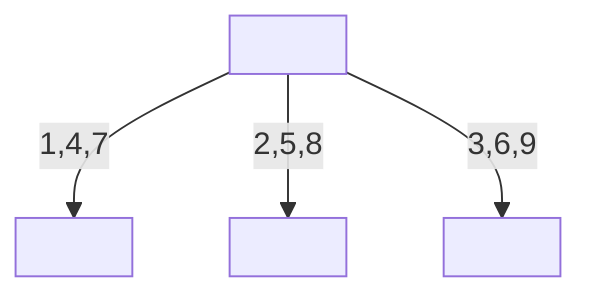
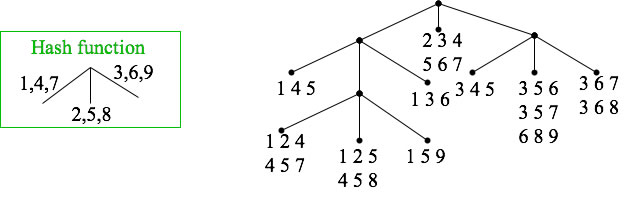
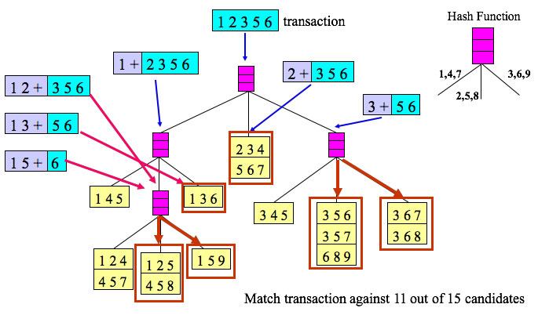
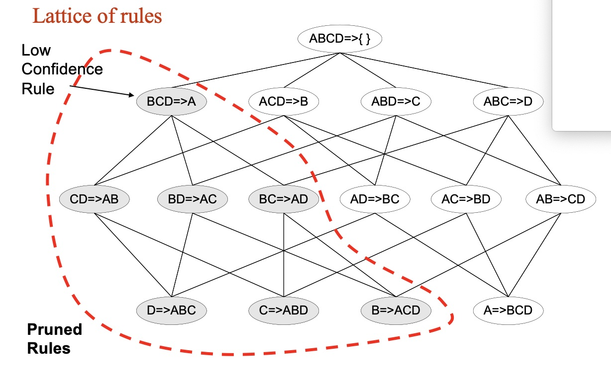

# A Gap Between Intuitive and Data: A Review of Data Mining

$$
\mathbf{\text{Wonjun Park}} \\
\text{Computer Science} \\
\text{University of Texas at Arlington} \\
\text{Arlington, TX, United States} \\
\text{wxp7177@mavs.uta.edu} \\
\text{Fall 2024}
$$

##### *Abstract*

$$
\mathbf{\text{Acronym and Abbreviation}} \\
\begin{array}{|c|c|}
\hline
\text{Information Retrieval (IR)} & \text{Term Frequency-Inversed Document Frequency (TF-IDF)} \\
\hline
\text{Knowledge Discovery in Database (KDD)} & \text{Machine Learning (ML)} \\
\hline
\text{Principle Component Analysis (PCA)} & \text{Singular Value Decomposition (SVD)} \\
\hline
\text{Simple Matching Coefficients (SMC)} & \text{Bayesian Belief Networks (BBN)} \\
\hline
\text{K-Nearest Neighbor (KNN)} & \text{Support Vector Machine (SVM)} \\
\hline
\text{Parallel Exemplar-Based Learning System (PEBLS)} & \text{Artificial Neural Networks (ANN)} \\
\hline
\text{Multi-Layer Perceptron (MLP)} & \text{Minimum Description Length (MDL)} \\
\hline
\text{Receiver Operating Characteristic (ROC)} & \text{True Positive Rate (TPR)} \\
\hline
\text{False Positive Rate (FPR)} & \text{Area Under the Curve (AUC)} \\
\hline
\text{Sum of Squared Error (SSE)} & \text{} \\
\hline
\end{array}
$$

***Keywords*** \
**Medoid**: The point in the cluster that minimizes the sum of the distances between itself and all the other points in the cluster.


### I. Introduction

### II. Literature Review

#### A. Simpson's Paradox

Simpson's Paradox refers to the result of statistics or probability data is reversed when the whole group of data is divided into several small groups. The situation in UC Berkeley Gender Bias [[1](#mjx-eqn-1)] representatively showed the paradox.

#### B. Definition of keywords in IR Systems

In order to address each language in IR, the common definition of terminologies is required. A **word** is a basic unit of language which the unit is separated by whitespace or punctuation in a text. A **term** is a meaningful unit, indexed and used in an IR system. The difference from **word** is that **term** is the basic units of meaning used to match documents with queries in the system. Additionally, **Term** is often called as normalized **word**. A **token** is a unit of text extracted from a document during the tokenization process. Tokenization is the proceess of breaking text into individual pieces which has multiple options to conduct the process. A **type** refers to the distinct class of tokens in a text. For instance, in the sentence "A dog sat on the mat with another dog", the tokens are ['A', 'dog', 'sat', 'on', 'the', 'mat', 'with', 'another', 'dog'], but the types are ['A', 'dog', 'sat', 'on', the', 'mat', 'with', 'another'], where 'dog' are repeated but only counted once as type. Due to their similarity, **type** and **term** are referred same as in most cases.

In summary, **1)** *word* is a string in a text, **2)** *token* is derived from *word* after tokenization processes which have their own pros and cons, **3)** *type* and *term* are referred to a list grouped the *token*s through the process of normalization under rules such as spelling or morphology. Hence, *Normalization* and *tokenization* are entailed.

**Normalization** \
*Normalization* is a step for general cleanup of text, such as removing needless whitespace, lowercasing, and/or removing accents [[2](#mjx-eqn-2)]. It is important that the *Normalization* step is conducted in IR systems, since users who used a IR system do not consider what they query to the system. For example, U.S.A and USA are different, but the IR system should match those words. Cases like Microsoft Windows and microsoft windows are another example. Typically, IR systems tackle these as removing dots and making all characters lower case. However, words like W.H.O and C.A.T (test) cause an error from the solution since they group with the word 'who' and 'cat' which have totally different meaning. The case of 'Windows' and 'windows' is another error of the solution. These problems lead the IR system to retrieve false positives in its result. Therefore, *Normalization* is crucial since the more IR system normalize *token*s with strict policies, the more its result become inefficient with the result equivalence classes become smaller as well as the less IR system normalize *token*s with loose policies, the less its result become inappropriate too with the number of equivalence classes become bigger.

The process that makes all characters become lowercase is called *Case Folding*. This is the popular preprocessing methods due to the fact that many users do not care about correct capitalization when they query to IR systems. For your information, however, in a few word, capital characters which include crucial meaning are so useful that many deep learning models consider the correct capitalization for their tokens.

**Tokenization** \
*Tokenization* indexes the the word in sentence [[2](#mjx-eqn-2)], splitting into what the algorithm of the tokenizer designs. The result become vary depending on what types of tokenizers are used. For example, in 'Hewlett-Packard', a tokenizer can remove the hypoon, making two seperate tokens. On the other hand, these two seperate words could be interpreted as different meaning such as directing two people, Hwelett and Packard, so that which does IR system use for tokeniers is crucial for its performance. Each tokenizer adopts different methods to compose their *token*s so that all tokenizers have their own benefits and drawbacks.

The string of numbers is another problem in IR systems. If a string 03201991 is given, what should we determine the type of the string? The string could be a date, March 20th 1991, or a phone number, (032)-019-991. Due to this problem, oldschool IR systems did not utilize the number strings. Yet, Google or recent IR systems process these numbers in their own ways to find relevant matches. (In programming assignment, in order to make the problem simple, we will not use index numbers. Just skip those numerical values.)

"a, an, and, are, at, the, ..." are *stopwords* utilized in sentences regardless of their context. *Stopswords* are usually eliminated during preprocessing steps, for they are mostly meaningless. Nevertheless, the elmination of *Stopwords* should be conducted carefully because they have some meaning sometimes. Take 'King of Denmark' for instance. If the stopword 'of' is removed, the meaning 'Denmark's king', which original word has, becomes ambiguous as 'the name of the king Denmark'. Similar to the string of numbers, the latest web serach engines have indexed these *stopwords* to produce more accurate search. (will not use in assignemnt too)

When it comes to composing equivalence classes for *type* or *term*, *phonetic equivalence* and *semantic equivalence* are needed to be contemplated. *Phonetic equivalence* refers to words which have same sound when we speak. For example, 'Muller' and 'Mueller' are identical. *Semantic equivalence* refers to words which have same meaning like 'car' and 'automobile'. These equivalence are consequently grouped in same classes for them. Two methods are used to address these equivalence; **1)** *Lemmatization* requires a lot of linguistic knowledge since it converts words into their basic form with the grammar rule of the language. For instance, "car, cars, car's, cars'" are translated into 'car', "am, are, is" become 'be', and "The boy's cars are different colors" is transfered to "The boy car be different color". Furthermore, *lemmatization* could be based on inflectional morphology like 'cutting' to 'cut' and derivational morphology such as 'destruction' to 'destroy'. **2)** *Stemming* does not require linguistic knowledge since it just cuts the end of words to only remain what the words principally mean with the hope that the cut will achieve what *lemmatization* achieves. For example, "automate, automatic, automation" are reduced to 'automat'. In other words, *stemming* is achieved as various algorithms which adopt different ways to remain the principal part.

*Porter Algorithm* is the most common algorithm for *stemming* in English. The algorithm is composed by sequential five phases of reductions. Each phase consists of a set of commands. For example, if a sample command were "Delete final 'ement' if what reamins is longer than 1 character", 'replacement' becomes 'replac' and 'cement' becomes 'cement'. If multiple suffixes matched, the longest suffix is prioritized.
(will use library for porter stemmer)

$$
\text{A few rules of Porter Stemmer} \\
\begin{array}{ccc|ccc}
\hline
\bf{\text{Rule}} & & & \bf{\text{Example}} & & \\
\hline
\text{sses} & \to & \text{ss} & \text{caresses} & \to & \text{caress} \\
\text{ies} & \to & \text{i} & \text{ponies} & \to & \text{poni} \\
\text{ss} & \to & \text{ss} & \text{caress} & \to & \text{caress} \\
\text{s} & \to & \text{} & \text{cats} & \to & \text{cat} \\
\hline
\end{array}
$$

*Lovins stemmer* and *Paice stemmer* are another algorithms to conduct *stemming*. Since stemmers are applied to both queries and documents, the lose of the word by stemmers does not matter. The performance is rather improved in most cases. Nevertheless, *Porter Algorithm* contains "operate, operating, operates, operations, ..." which are too broad to implicate in a one class 'oper', resulting in different meaning in the one class like 'operational system' and 'operation' in surgical.

Google, the latest and most advanced search engine, has utilized *stopwords*, *normalization*, *tokenization*, *lowercasing*, *stemming*, non-latin alphabets, umlauts, compunds, *numbers*.

#### C. Ranked Retrieval

The question may arise at this point. "How could we match the query of the user to give results?" If the IR system only took boolean search, this question becomes simple. However, there are two problems: **1)** The most queries from users are not the type of the question answered as yes or no. **2)** Boolean queries often result in either too few (almost zero) or too many (1000s) results. What the IR system needs is the top 10 results which users can focus on their answers.

<!-- 1) and 2) seems to be the same goal. need to check and fix it -->
**Ranked retrieval** gives a score based on the similiarity between queries and documents. The score is normally in range 0 to 1. The goal of **Ranked retrieval** is that **1)** the more frequent a query term in the document, the higher score the document get and **2)** the more query terms occur in the document, the higher score the document get. In addition, **3)** the length of the document should be considered in both rules. These three elements derive a conflict so that various algorithms are selected in each optimal situation;

**Jaccard coefficient** is a common value to measure the overlap of two sets. Let $A$ and $B$ are two different sets,

$$
JACCARD(A, B) = {|A \cap B| \over |A \cup B|} \quad ,(A \not = \emptyset \text{ or } B \not = \emptyset) \\
\\
JACCARD(A, A) = 1 \\
JACCARD(A, B) = 0 \text{, if } A \cap B = 0
$$

The sets do not need to be same size. Take query "ideas of March" and Document "Caesar died in March" for example. $JACCARD(q,d)$ is $1 \over 6$. However, Jaccard has three limitations to apply in **Ranked Retrieval**: **1)** It does not consider the frequency of terms. Hinged on basic knowledge, if a query were "CSE student" and documents $d_1$ "CSE at UTA", $d_2$ "CSE CSE at UTA", $d_2$ should be ranked as higher than $d_1$. Nevertheless, they got the same score as $1 \over 4$ in Jaccard, since it is the set operation. **2)** The **Jaccard coefficient** does not handle the important word where important information is implicated. Suppose two queries $q_1$ "CSE student" and $q_2$ "The CSE student". Although the most important word is 'CSE' based on the common knowledge, Jaccard tackle all words as a same weight. The last problem is that **3)** the coefficient does not normalize the length of the document. If the previous example, $d_1$ and $d_2$, had additional words not related with the query which each length is 20 and 1,000, $d_1$ becomes highly ranked than $d_2$ since the denominator of the coefficient are drastically larger.

In order to replace **Jaccard**, three matrix are prioritized to be reviewed;

**1) Binary incidence matrix** shows whether each term is appear in each document or not. For instance, the $\text{Tab. 2}$ shows the appearance of each term in each row.

$$
\text{Table 2. Example of Binary Incidence Matrix} \\
\begin{array}{c|cccccc}
\hline
& \text{Anthony and Cleopatra} & \text{Julius Caesar} & \text{The Tempest} & \text{Hamlet} & \text{Othello} & \text{Macbeth} \\
\hline
\text{ANTHONY} & 1 & 1 & 0 & 0 & 0 & 1 \\
\text{BRUTUS} & 1 & 1 & 0 & 1 & 0 & 0 \\
\text{CAESAR} & 1 & 1 & 0 & 1 & 1 & 1 \\
\text{CALPURNIA} & 0 & 1 & 0 & 0 & 0 & 0 \\
\text{CLEOPATRA} & 1 & 0 & 0 & 0 & 0 & 0 \\
\text{MERCY} & 1 & 0 & 1 & 1 & 1 & 1 \\
\text{WORSER} & 1 & 0 & 1 & 1 & 1 & 0
\end{array}
$$

**2) Count matrix** shows the number of times each terms appears in each document. For instance, the $\text{Tab. 3}$ shows the number of times each term appears in each row.

$$
\text{Table 3. Example of Count Matrix} \\
\begin{array}{c|cccccc}
\hline
& \text{Anthony and Cleopatra} & \text{Julius Caesar} & \text{The Tempest} & \text{Hamlet} & \text{Othello} & \text{Macbeth} \\
\hline
\text{ANTHONY} & 157 & 73 & 0 & 0 & 0 & 0 \\
\text{BRUTUS} & 4 & 157 & 0 & 2 & 0 & 0 \\
\text{CAESAR} & 232 & 227 & 0 & 0 & 0 & 0 \\
\text{CALPURNIA} & 0 & 10 & 0 & 0 & 0 & 0 \\
\text{CLEOPATRA} & 57 & 0 & 0 & 0 & 0 & 0 \\
\text{MERCY} & 2 & 0 & 3 & 8 & 5 & 8 \\
\text{WORSER} & 2 & 0 & 1 & 1 & 1 & 5
\end{array}
$$

For the top of the paper (class), only **bag of words** models are utilized. **Bag of words** refers to, without considering the order in which they appear, the representation of text which describes the presence of words within the text data.

**Term Frequency**, $\text{tf}_{t,d}$, is the number of times that the term $t$ appears in the document $d$. However, the $\text{tf}$ alone itself is not enough to understand the importance of the term in the document. For instance, $\text{tf}_{t_1, d} = 10$ does not mean that the $t_1$ is 10 times more important than $t_2$ where $\text{tf}_{t_2, d} = 1$. To solve this problem, **Log Frequency Weighting** was proposed. The log frequency weight $w_{t,d}$ is defined as follows:

$$
\begin{array}{c|cc}
w_{t,d} = & 1 + \log_{10}(\text{tf}_{t,d}) & \text{if } \text{tf}_{t,d} > 0 \\
& 0 & \text{otherwise}
\end{array} \\
\mathbf{\text{NOTICE THAT DEFINING 0 FOR OTERHWISE CASE IS CRITICAL IN ASSIGNEMENTS OR EXAMS}}
$$

With **Log Frequency Weighting**, the **Ranked Retrieval** score, from the previous $\text{tf-matching-scroe}(q, d) = \text{tf}_{t,d}$, $\text{tf-matching-score}(q, d)$ for term $t$ in both query $q$ and document $d$ is calculated as follows:

$$
\text{tf-matching-score}(q, d) = \sum_{t \in q \cap d} w_{t,d} = \sum_{t \in q \cap d} (1 + \log(\text{tf}_{t,d}))
$$

where the score is 0 if the term does not appear in the document.

The score does not have an upper bound unlike the **Jaccard Matching Score** and reflects the frequency of the term in the document. However, the score does not consider the weight of the term such as 'a', 'the', and 'is' which are common among all documents. Rare terms are more informative than common terms so that the score, high weights fore rare terms and low eights for common terms, is required.

**Collection frequency** refers to the total frequency of the term in a collection, a set of all documents. In other words, **collection Frequency** $\text{cf}_t$ is <ins>the number of terms</ins>. The **document frequency** $\text{df}_t$ is <ins>the number of documents</ins> that contain term $t$, a sum of a binary value whether the term is presented in the document or not. With $\text{df}_t$, the **Inverse Document Frequency** $\text{idf}_t$ is calculated as follows:

$$
\text{idf}_t = \log_{10}\left(\frac{N}{\text{df}_t}\right)
$$

where $N$ refers to the number of all documents in the collection. The calculated value $\text{idf}_t$ becomes lower if the term appears in many documents. For example, if a term 'the' appears in all 1,000 documents ($\text{df}_t = 1,000$), the $\text{idf}_t$ is 0.

As a result, with the **Log Frequency Weighting**, the weight of **Term Frequency-Inverse Document Frequency** ($\text{tf-idf}$), a idf weighting, is calculated as follows:

$$
w_{t,d} = (1 + \log_{10}(\text{tf}_{t,d})) \times \log_{10}\left(\frac{N}{\text{df}_t}\right)
$$

Still, the $\text{idf}$ is ineffective for one-term queries.

**3) TF-IDF matrix** shows the $tf-idf$ weights for each term in each document. For instance, the $\text{Tab. 4}$ shows the $tf-idf$ weights for each term in each row.

$$
\text{Table 4. Example of TF-IDF Matrix} \\
\begin{array}{c|cccccc}
\hline
& \text{Anthony and Cleopatra} & \text{Julius Caesar} & \text{The Tempest} & \text{Hamlet} & \text{Othello} & \text{Macbeth} \\
\hline
\text{ANTHONY} & 5.25 & 3.18 & 0 & 0 & 0 & 0.35 \\
\text{BRUTUS} & 1.21 & 6.10 & 0 & 1.0 & 0 & 0 \\
\text{CAESAR} & 8.59 & 2.54 & 0 & 1.51 & 0.25 & 0 \\
\text{CALPURNIA} & 0 & 1.54 & 0 & 0 & 0 & 0 \\
\text{CLEOPATRA} & 2.85 & 0 & 0 & 0 & 0 & 0 \\
\text{MERCY} & 1.51 & 0 & 1.90 & 0.12 & 5.25 & 0.88 \\
\text{WORSER} & 1.37 & 0 & 0.11 & 4.15 & 0.25 & 1.95
\end{array}
$$

The **vector space model** is a model in which each document is represented as a vector in a $N_t$-dimensional space where $N_t$ is **Collection frequency** $\text{cf}_t$. Queries are also represented as vectors in the same space. Whatever preprocessing do in query, do in document is needed. Two perspectives are available to calculate the similarity to between the query and the documents to derive the **Ranked Retrieval** score; **1) Euclidean distance** and **2) Cosine similarity**.

cf. Each term becomes axis of dimensions. If we concatenated two n-dimension vectors, it becomes (n+1)-dimensional vector. For instance, if we concatenate two squares in 2D, it becomes a rectangle in 3D. (IT'S RIGHT. BUT I THINK IT CAN DEPENDS ON WHERE WE CONCATENATE. IF WE CONCATENATE 3-DIMENSIONAL VECTORS IN AXIS 0, IT BECOMES 3-DIMENSIONAL VECTOR BUT IF WE CONCATENATE IN AXIS 1, IT BECOMES 6-DIMENSIONAL VECTOR)

(Skip for the summary of Euclidean distance) However, **1) Euclidean distance** is not suitable for the **Ranked Retrieval** because the distance is not normalized. The distance is affected by the length of the document. For instance, the distance between the query and the document is larger if the document is longer. Using angle instead of distance, **2) Cosine similiarity** is not affected by the length of the document. In other words, the **cosine similarity** is implicated the step of the length normalization which makes a document vector to have a unit vector.

$$
\text{Cosine Similarity} = \frac{\vec{q} \cdot \vec{d}}{||\vec{q}|| \times ||\vec{d}||} \\
\mathbf{\text{ONLY FOR THE UNIT VECTORS}} \text{: } \text{Cosine Similarity} = \vec{q} \cdot \vec{d}
$$

Different weightings for queries and documents are often and expressed as $ddd.qqq$ format. The former $ddd$ refers to the weighting of the document and the latter $qqq$ refers to the weighting of the query. All components of $\text{tf-idf}$ is on the following table.

$$
\text{Table 5. Components of tf-idf} \\
\begin{array}{|c|c|c|}
\hline
\text{Term Frequency tf} & \text{Document Frequency df} & \text{Normalization} \\
\hline
\begin{array}{cc}
\text{n (natural)} & \text{tf}_{t,d} \\
\text{l (logarithmic)} & 1 + \log(\text{tf}_{t,d}) \\
\text{a (augmented)} & 0.5 + 0.5 \times \frac{\text{tf}_{t,d}}{\max_{t' \in d} \text{tf}_{t',d}} \\
\text{b (boolean)} & 1 \text{, if } \text{tf}_{t,d} > 0 \text{, otherwise 0} \\
\text{L (log average)} & {1 + \log{\text{tf}_{t,d}} \over {1 + \log{(ave_{t' \in d} \text{tf}_{t',d})}} \\}
\end{array} &
\begin{array}{cc}
\text{n (no)} & 1 \\
\text{t (idf)} & \log{N \over \text{df}_t} \\
\text{p (prob idf)} & max(0, \log{N - \text{df}_t \over \text{df}_t}) \\
\end{array} &
\begin{array}{cc}
\text{n (none)} & 1 \\
\text{c (cosine)} & 1 \over {\sqrt{w_1^2 + w_2^2 + \cdots + w_M^2}} \\
\text{u (pivoted unique)} & 1 \over u \\
\text{b (byte size)} & {1 \over \text{CharLength}^a}, a < 1
\end{array} \\
\hline
\end{array}
$$

For example, 'lnc.ltn' means that document is 1) logarithmic $\text{tf}$, 2) no $\text{df}$ weighting, and 3) cosine normalization, and query is 1) logarithmic $\text{tf}$, 2) logarithmic ($\text{i}$)$\text{df}$, and 3) no normalization. Sometimes, not using $\text{idf}$ in documents is not bad for the performance of IR systems.

In conclusion, reviewing three types of matrixs and **vector space model**, IR systems return the top K, like 10, documents which have the highest scores to the users.

#### D. Data Mining

The four Vs in Big Data define what Big Data is. **1) Volume** refers to the size of the datasets. Most U.S. companies have more than 100 terabytes of data, 40 Zettbytes of data are expected to be generated in a year by 2020. In order to process the sheer volume of the data, distinct and different technologies than traditional ones is required. **2) Variety** is the types of data. Importantly, the data is classified into three types; **Structured data**, **Semi-structured data**, and **Unstructured data**. **Structured data** is the data which is organized in a tabular format, like relational database tables and CSV/TSV files. **Semi-structured data** is the data which is not organized in a tabular format but has some organizational properties, like XML, JSON, and RDF. **Unstructured data** is the data which is not organized in a tabular format and does not have any organizational properties, like text data, videos, audio, and binary data files. As of 2011, the global healthcare data was estimated to be 150 exabytes and, by 2020, 420 million wearable and wireless health monitors were expected to be use.  **3) Velocity** is the speed of the data. The data is generated faster than every before. For instance, the data from the New York Stock Exchange is generated in terabytes every day and more than 4 billion hours of video were watched on YouTube every month. **4) Veracity** is the quality of the data. The data is often dirty, incomplete, and inconsistent which makes it difficult to trust the data since data quickly becomes outdated and information shared via the Internet and social media does not necessarily have to be correct.

A lot of datasets such as Amazon Public Data Sets and Data.gov are available. More information is on the lecture note page 11-13.

**Data Mining** is the extraction of interesting patterns or knowledge from huge amount of data. Retreving data and addressing not interesting data such as trivial, explicit, known, and useless are not the purpose of data mining. Marketing, retail, banking, medicine, and fraud detection are the fields where data mining is utilized.

**KDD** process is a classic process in data mining, discovering useful knowledge from large volumes of data. The process involves several stages where the transition to any other stages is allowed in each stage:

$$
\text{Data} \quad \underrightarrow{\text{Selection}} \quad \text{Target Data} \quad \underrightarrow{\text{Preprocessing}} \quad\ \text{Preprocessed Data} \quad \underrightarrow{\text{Trnasformation}} \quad \text{Transformed Data} \\
\underrightarrow{\text{Data Mining}} \quad \text{Patterns} \quad \underrightarrow{\text{Interpretation / Evaluation}} \quad \text{Knowledge}
$$

Typically, pattern discovery, association and correlation, classification, clustering, outlier analysis are the tasks in **data mining** from the perspective from ML and statistics. The pattern discovery is the task to find patterns in the data. The classification is the task to classify data into different classes. The clustering is the task to group data into clusters. The association rule mining is the task to find rules that describe the relationship between items in the data. The outlier detection is the task to find data that is significantly different from the rest of the data.

A lot of data mining software are summarized in the lecture note page 19.

#### E. Data and Data Preprocessing

**Data** is the raw material, a collection of facts, figures, and statistics that can be processed to produce information. In structed data, data is a collection of objects and their attributes. An object is a row of a table in structed data, and an attribute is a column of a table, a property or characteristic of an object.

Attributes can be different types, such as numbers, text, dates, etc. For example, in a table of students, the attributes would have attributes like student ID as a number, student name as text. Same values in different attributes normally have different meanings. Take student ID and age as an example. A student who is 20 years old can get a student ID of 20, but the two 20s have different meanings. A same attribute can also have different values. Height is measured as feet and inches, resulting in two values for the same attribute.

By the measurement scale, attributes are classified into four types: nominal, ordinal, interval, and ratio. These attributes hierarchically have different properties; nominal $\subset$ ordinal $\subset$ interval $\subset$ ratio. **1) Nominal attributes** refers to the type of attributes that have *distinctness* properties, compared by $=, \not=$. For example, eye color is a nominal attribute as well as student ID is a nominal attribute in terms of it is unique to each student. **2) Ordinal attributes** have *order* properties, represented as <, >. Rankings, such as student grade, satisfaction level, and height are ordinal attributes. **3) Interval attributes** have the *difference (addition)* property, written as $+, -$, which differences between values are meaningful. For instance, temperature in Celsius or Fahrenheit is an interval attribute and dates on calendar are interval attributes. **4) Ratio attributes** have the properties of nominal, ordinal, and interval attributes as well as *multiplication and division ($\times$, $\div$)* are meaningful. For example, temperature in Kelvin is a ratio attribute.

For more details of the temperature, Kelvin starts at absolute zero, causing the ratio between two Kelvin values to be meaningful. 300$K$ is twice as hot as 150$K$. However, Celsius and Fahrenheit do not have an absolute zero, so the ratio between two Celsius or Fahrenheit values is not meaningful. 40$^{\circ}C$ is not twice as hot as 20$^{\circ}C$ as well as Fahrenheit.

By the number of values, attributes are classified into two types: discrete and continuous. **1)** Discrete attributes have a finite number of values, such as zip codes, counts, or the set of words in a collection of documents. They are often represented as integers. **2)** Continuous attributes have an infinite number of values, such as temperature, height, and weight. Real values are only measured from these attributes and are often represented as floating-point numbers.

"""
Important Characteristics of Structed Data
1. Dimensionality - the number of attributes in the data. High-dimensional data is a large number of attributes and is complex to analyze and visualize. The problem, known as the curse of dimensionality, occurs when the number of attributes is too large.
2. Sparsity - the percentage of zero values in the data. Sparse data has a large number of zero values, causing a problem in data analysis and data mining.
3. Resolution - the scale of the data, composing patterns. In other words, the resolution of the data is the level of detail in the data.
"""

Three types of datasets were reviewed; **1) Record data** is the most common type of data, which is a collection of records, each of which consists of a fixed set of attributes. A **data matrix** is a two-dimensional data matrix, where rows represent records and columns represent attributes. Data objects which have the same fixed set of numeric attributes are represented as a multi-dimensional vector, shown as the two-dimensional table. **Document data** is a collection of text documents, where each document becomes a term vector. The value in the each vector corresponds the occurence of the term in the document. **Transaction data** is a special type of record data, where each record (transaction) involves a transaction, such as a purchase, a bank transaction, or a call record.

**2) Graph data** is a collection of nodes and edges, where nodes represent entities and edges represent relationships between entities. **World Wide Web** is a graph data, where web pages are nodes and hyperlinks are edges. **Molecular (chemical) structures** are also graph data, where atoms are nodes and bonds are edges. **3) Ordered data** is a collection of sequences, where the order of data objects is important. **Genomic sequence data** is an example of ordered data, where the order of nucleotides is critical. **Spatio-temporal data** is also ordered data which includes both space and time information.

**Data Quality** is an important issue in data mining, as the quality of data affects the quality of the results. Data quality issues include noise, outliers, missing values, and duplicate data. **1)** Noise is a unwanted data, a random error or variance during a mesurements, causing the modification of original data. **2)** Outliers are data objects significantly different from the rest of the data, produced by errors in data collection or data processing. **3)** Missing values are data objects with missing attribute values. Missing values are addressed by removing the data objects with missing values, estimating the missing values as a global constant, an attribute mean, or a learning algorithm that can estimate missing values, ignoring the missing values during data analysis. **4)** Duplicate data are data objects that are duplicates of other data objects moajorly emerged during merging data from heterogeneous sources. Data cleaning, a process of removing duplicated objects, is conducted to erase the duplicates.

**Data Preprocessing** is a process of converting raw data into an required format. Data preprocessing contains **aggregation, sampling, dimensionality reduction, feature subset selection, feature creation, discretization and binarization**, and **attribute transformation**. **Aggregation** is a process of combining two or more attributes into a single attribute, changing the scale of the data like from daily data to monthly data. The volume of data is reduced, resulting in a more stable and less variability data. **Sampling** is a process of selecting a subset of an original dataset, employed to reduce the data size and the cost of data analysis. Since the entire dataset is generally too large and expensive (regarding both time and money) to analyze and process, sampling becomes a solution to the problem. Furthermore, on the other side of the down-sampling, upsampling is also conducted to increase the size of the dataset when the dataset is too small. The key principle of sampling is that the subset made by sampling should have same properties as the original dataset.

Four types of sampling are introduced; **1) Random sampling** is a process that selects data objects with an equal probability. **2) Without replacement sampling** is a process that removes the selected data object from the population. **3) With replacement sampling** is a process that does not remove the selected data object from the population. **4) Stratified sampling** is a process that divides the population into subpopulations and then selects data objects from each subpopulation so that the sampled dataset is ensured to have the same distribution as the original dataset.

**Sample size** is a matter of concern in sampling, since if the sample size is too small, the sample may not represent the pattern of the population, and if the sample size is too large, the sample may be redundant. For instance, if the number of classes is 10, the sample size should be at least 10 to select all classes due to pigeonhole principle.

**Dimensionality Reduction** is a process of reducing the number of attributes in the data. Curse of dimensionality occurs when the number of attributes is too large, causing the complexity of data analysis and visualization. According to the plot in $\text{Fig. 1}$ below, the variation of the data is decreased as the number of attributes increases. To solve the problem, PCA, SVD, and other dimensionality reduction techniques like supervised or non-linear dimensionality reduction are employed. PCA is a technique that transforms the data into a new coordinate system, where the new axes are the principal components of the data. In other terms, the eigenvectors of the covariance matrix are the new axes derived from PCA.

 \
$\text{Fig. 1. Plot of the curse of dimensionality}$ [[3](#mjx-eqn-3)]

**Feature Subset Selection** is another way to reduce dimensionality. Four techniques, brute-force, embedded, filter, and wrapper, are utilized. Brute-force is a technique that tries all possible subsets of attributes and selects the best subset. Embedded is a technique that naturally selects as the part of the data mining algorithm. Filter is a technique that selects before the data mining algorithm is applied. Wrapper is a technique that uses the data mining algorithm as a black box to find the best subset of attributes.

**Feature Creation** is a process of creating new attributes from the original attributes to capture the crucial patterns much more efficiently than the original attributes. For example, if the original attributes are height and weight, the new attribute, BMI, can be created by the formula $\text{BMI} = \frac{\text{weight}}{\text{height}^2}$. Three approaches are employed to create new attributes; **1)** Feature extraction with domain-specific knowledge, **2)** Mapping the data into a new space, and **3)** Feature construction by combining the original attributes. In addition to the BMI example above, the signal combination with Fourier Transform or Wavelet Transform is another example of feature creation.

**Discretization (Binarization)** is a process of converting continuous attributes into discrete attributes. **1)** Entropy-based discretization is a supervised technique that divides the data into manually defined intervals, labeling the data with the interval. **2)** Unsupervised discretization is a technique that divides the data into intervals without class labels. Equal interval width, equal frequency, and clustering are the three techniques of unsupervised discretization.

**Attribute Transformation** is a process to transform or to scale the data into a new form with functions like $x^k, \log(x), \exp(x), \sin(x), \|x\|, \text{etc.}$. Standardization and normalization are also employed to convert the data into a new form.

#### F. Similarity and Distance Measures

Similarity and dissimilarity (distance) are numerical measures of how alike or different two data objects are. Similarity is often normalized as [0, 1], while dissimilarity often has minimum value 0 and no uppber bound.

When $p$ and $q$ are attribute values of two data objects, simple methods for calculating similarity and dissimilarity are as follows:

$$
\begin{array}{|c|c|c|}
\hdashline
\text{Attribute} & \text{Similarity} & \text{Dissimilarity} \\
\hline
\text{Nominal} & s = \begin{cases} 1 & \text{if } p = q \\ 0 & \text{if } p \neq q \end{cases} & d = \begin{cases} 0 & \text{if } p = q \\ 1 & \text{if } p \neq q \end{cases} \\
\text{Ordinal} & s = 1 - \frac{|p - q|}{n - 1} \; (s = 1-d) & d = \frac{|p - q|}{n - 1} \\
& (\text{where } n \text{ is the number of values, mapping the values to integers 0 to n-1}) \\
\hline
\text{Interval or Ratio} & s = -d, s = \frac{1}{1+d} & d = |p - q| \\
\hline
\end{array}
$$

The **Euclidean distance**, a specific case of **Minkowski Distance**, is commonly a measure of **dissimilarity** between two point $p$ and $q$.

$$
\text{dist} = \left( \sum_{i=1}^{n} |p_i - q_i|^r \right)^{1/r} \begin{cases} r = 1, & \text{Manhattan distance, L1 norm} \\ r = 2, & \text{Euclidean distance, L2 norm} \\ r = \infty, & \text{Supremum (Chebyshev) distance, L}_\text{max}\text{ norm, L}_\infty\text{ norm} \end{cases}
$$

where $r$ is the dimension of the distance and $n$ is the number of attributes. In most cases, since the scale of each attribute is different, the standardization is necessary. The standardization is processed by subttracting the mean and dividing by the standard deviation or by scaling the values to [0, 1] by the formula $\frac{\text{target}_{d} - \text{min}_{d_i}}{\text{max}_{d_i} - \text{min}_{d_i}}$

For Supremum distance $L_\text{max}$ or $L_\infty$ norm, the distance converges to the maximum difference among attributes from the two vectors.

These distances have the following well-known properties which a distance that satisfies these properties is called a metric; \
$\quad\text{1.}$ $d(p, q) \geq 0$ : Positive definiteness for all $p$ and $q$. 0 only if $p = q$. \
$\quad\text{2.}$ $d(p, q) = d(q, p)$ : Symmetry for all $p$ and $q$. \
$\quad\text{3.}$ $d(p, q) + d(q, r) \geq d(p, r)$ : Triangle Inequality for all points $p, q, r$.

**Similarity** also have common properties, \
$\quad\text{1.}$ $s(p, q) = 1 \text{ only if } p = q$ : Identity. (1 or the maximum similarity value) \
$\quad\text{2.}$ $s(p, q) = s(q, p)$ : Symmetry  for all $p$ and $q$

Between binary vectors, the **1) SMC (Simple Matching Coefficient)** and **2) Jaccard Coefficient** are normal measures of similarity. The SMC is the proportion of matching attributes to the total number of attributes. Specifically, when

$$
\begin{array}{c|c|c}
& \text{SMC} & \text{Jaccard Coefficient} \\
\hline
M_{pq} = \begin{cases} M_{01} \quad p=0, q=1 \\ M_{10} \quad p=1, q=0 \\ M_{11} \quad p=1, q=1 \\ M_{00} \quad p=0, q=0 \end{cases} & \frac{M_{11} + M_{00}}{M_{11} + M_{00} + M_{10} + M_{01}} & \frac{M_{11}}{M_{11} + M_{10} + M_{01}} \\
(\text{The number of attributes for each case } p \text{ and } q) \\
\hline
\text{ex. } p = \text{1 0 0 0 0 0 0 0 0 0, }q = \text{0 0 0 0 0 0 1 0 0 1} & \frac{0 + 7}{0 + 7 + 1 + 2} = \frac{7}{10} & \frac{0}{0 + 1 + 2} = 0
\end{array}
$$

These two coefficient differ in the precense of $M_{00}$ value, giving different results. Consequently, each coefficient is suitable for different cases. **SMC** is better when $M_{00}$ has an important meaning to translate the similarity. **Jaccard Coefficient** is more suitable when $M_{00}$ is meaningless. In other words, **SMC** is effective when the data matrix has the enough number of $M_{00}$ to be critical, while **Jaccard Coefficient** is more effective when the data matrix has $M_{00}$ to be ignored.

Repeteadly, **3) Cosine Similarity** is also used to measure the similarity between two document vectors besides binary vectors. **4) Pearson Correlation Coefficient** measures the linear correlation between two vectors. the range of the coefficient is [-1, 1] where 1 is total positive correlation, 0 is no correlation, and -1 is total negative correlation. The formula is as follows:

$$
\text{Pearson Correlation Coefficient} = \frac{\text{covariance}_{x,y}}{\sigma_x \sigma_y} =
\frac{\sum_{i=1}^{n} (p_i - \bar{p})(q_i - \bar{q})}{\sqrt{\sum_{i=1}^{n} (p_i - \bar{p})^2} \sqrt{\sum_{i=1}^{n} (q_i - \bar{q})^2}}
$$

where $\bar{p}$ and $\bar{q}$ are the means of the vectors $p$ and $q$, $\frac{1}{n} \sum_{i=1}^{n} p_i$ and $\frac{1}{n} \sum_{i=1}^{n} q_i$.

When it comes to the need of an overall similarity (a similarity between two objects which have several types of attributes) among different types of attributes, \
$\quad\text{1.}$ Define an indicator variable $\sigma_k$ for the k-th attribute as follows:

$$
\sigma_k = \begin{cases} 0 & \text{(if the } k^\text{th} \text{ attribute is a binary asymmetric attribute AND both objects have a 0 value)} \\ & \text{or (if one of the object has a missing value for the } k^\text{th} \text{ attribute)} \\ 1 & \text{otherwise} \end{cases}
$$

$\quad\text{2.}$ With the similarity of the $k^\text{th}$ attribute $s_k$, the overall similarity between two objects is calculated as:

$$
s(p, q) = \frac{\sum_{k=1}^{n} s_k \cdot \sigma_k}{\sum_{k=1}^{n} \sigma_k}
$$

Weighting the similarity or dissimilarity of the attributes is also possible to treat the attributes differently. Using weights $w_k$ between 0 and 1 for each attribute and the sum of the weights is 1,

$$
\text{similarity} = \frac{\sum_{k=1}^{n} w_k \cdot \sigma_k \cdot s_k}{\sum_{k=1}^{n} \sigma_k} \\
\text{distance} = (\sum_{k=1}^{n} w_k | p_k - q_k |^r)^{1/r}
$$

#### G. Decision Tree

Classification is to find a model that describes and distinguishes data classes or concepts for each class attribute among other attributes. The goal is to predict unknown data using the model. Train, validate, and test data are utilized to build the model. Specifically, train and validate data are in the training process which are utilized to train the model and check if the model is trained well respectively. After the training process, test data evaluates the model performance.

A few comparisions in Machine Learning (ML) follows: **1)** Classification versus Prediction and **2)** Supervised Learning versus Unsupervised Learning. Classificaiton is to predict categorical class labels which are finite and discrete. Nominal attributes are most suited for classificaiton rather than ordinal attributes. Prediction is to predict continuous values which are infinite. Ordinal attributes are most fitted for prediction. Considering the relationship between the type of attributes, classification is belong to the prediction task.

Supervised Learning refers to when the model is trained on a labeled training dataset. Supervision is the process of providing the model with the correct answer as observation and measurement. New data like test data is classified hinged on the training set. Classification and regression are the most common supervised learning types. Unsupervised Learning is called when the model is trained on an unlabeled dataset. Clustering is the common example of Unsupervised Learning.

--Classification Techniques: Decision Tree based methods, Rule-based methods, Memory-based reasoning, Neural Networks, Support Vector Machines, and Naive Bayes and Bayesian Belief Networks--

**Decision Tree** is a tree-like graph of decisions and their possible consequences. Specifically, splitting attributes make a decision yes or no, classifying data. Both binary and multi-way decision tree are available on one's preference. However, if data has conflicting attributes, decision tree can not solve the problem. Large search space is another limitation of decision tree, making the optimal decision tree computationally infeasible.

With a single dataset, many different decision trees are possible. Despite a variety of decision trees, the problem to find the optimal decision tree is NP-complete which no efficient solution algorithm has been found. Algorithms based on greedy algorithm have been proposed to construct the decision tree, making locally optimal decisions in selecting the best attribute to split the data.

Among a few algorithms like Hunt's Algorithm, CART, ID3, C4.5, SLIQ, and SPRINT, the paper reviewed Hunt's Algorithm, a one of the earliest decision tree algorithms and the foundation of other decision tree algorithms.

**Hunt's Algorithm** is a recursive algorithm that partitions the data into subsets based on the attribute value, ensuring that each partition is as pure as possible. The subset is considered pure if all the data in the subset belongs to the same class or no further meaningful partition can be made. The algorithm is as follows:

``` plaintext
Start from a tree with a single root node containing all the training data.

Recursive:
    1. Check if the node is homogeneous (pure).
        - If true, make the node a leaf node and label it with the class. END the branch.
        - If not, continue to the next step.
    2. Check if the node is empty.
        - If true, make the node a leaf node. END the branch.
        - If not, continue to the next step.
    3. Check whether the node has conflicting data, a same label with different values.
        - If true, mark the node as a leaf node. END the branch.
        - If not, continue to the next step.
    4. Split the node into child nodes based on the attribute.
        - During the split, the algorithm calculates the impurity of the child nodes
            using the 1) Gini index, 2) entropy, or 3) misclassification error.
        - After splitting, the Gain is recalculated to renew the tree state.

Terminate:
    1. If all nodes become leaf nodes during the recursive process.
    2. If the split does not show certain improvement than beforehanded-set threshold, regarding the impurity
        - When it comes to the large number of data, the accuracy would not be improved significantly even after the split.
        - For example, if 100,000,000 data were input, in a certain point such as a 1,000 impurity node, the split would not impact to the accuracy of the whole tree even if the half of the data were wrong.
        - This also leads the tree to be overfitted.
```

Regarding the split, two questions are raised. **1)** How to split with different types of attributes? **2)** How to determine the best split?

The first question is answered by the type of attributes. Nominal and Ordinal attributes are treated as categorical attributes. For example, if the attribute is color, the node is splitted into red, blue, and green or if the attribute is size, the node is split into small, medium, and large. In this case, if categories are grouped into two, this is called 2-way split. If categories are grouped into three or more, this is called multi-way split. Interval and Ratio attributes are treated as numeric attributes. For example, if the attribute is age, the node is split into age < 20, 20 <= age < 40, 40 <= age < 60, and age >= 60. Aslike the categorical attributes, if the numeric attributes are grouped into two, this is called binary split. If the numeric attributes are grouped into three or more, this is called multi-split.

To determine whether 2-way or multi-way split is needed, the algorithm calculates **Gain** with the following metrics for each possible children node. Especially for the continuous attributes, the algorithm converts the continuous values into discrete values the threshold usually the mean or median because it is inefficient that the algorithm calculates the metrics for all possible threshold values. (In the class, only 2-way split will be used.)

The second question is dealt with the metrics to measure the impurity of the child nodes. Three evaluation metrics are used to measure the impurity of the child nodes. **1) Misclassification error** is the simplest metric to calculate the impurity of the splitted tree. The formula is:

$$
\text{Misclassification Error} = 1 - \max(p_i)
$$

For example, in binary split, if the node is splitted into 3:7, the misclassification error is $\frac{3}{10}$ and if the node is splitted into 5:5, the misclassification error is $\frac{5}{10}$. In multi-split, if the node is splitted into 3:3:3, the misclassification error is $\frac{6}{9}$ as well as if the node is splitted into 2:3:5, the misclassification error is $\frac{5}{10}$.

However, the metric has a limitation that it tends to prefer splits that result in a large number of partitions, which the partitions are small, causing the risk of overfitting and the complex model.

**2) Gini index**, also known as Gini impurity, is a measure to quantify the impurity or diversity of a dataset. The formula for calculating the Gini index is:

$$
\text{Gini} = 1 - \sum_{i=1}^{c} p_i^2 \
\left\{
\begin{aligned}
& c = \text{the number of classes} \\
& p_i = \text{the probability of selecting an item of class } i \text{ in the node}
\end{aligned}
\right.
$$

Two properties, regarding min-max and the ratio of the classes, are notable. **1)** The loweset value of Gini index is 0, when the node is pure. The highest value of Gini index is 0.5 for the number of classes is 2 and 0.67 for 3 classes when the node is equally distributed. In general, when the number of classes is $c$, $\text{Gini} = \begin{cases} \text{Minimum} = 0 \\ \text{Maximum} = 1 - \frac{1}{c} \end{cases}$ **2)** If the ratio of the classes are same between different nodes, the Gini value is same regardless of the number of datas. These properties lead the intuition to estimate the value of the Gini index before calculating it. For example, if a node is close to a 1:1 ratio of two classes, the Gini index is close to 0.5.


The Gain of the Gini index is calculated by subtracting the weighted average of the child nodes' impurity from the parent node's impurity. The formula for calculating the Gain is:

$$
\text{Gain} = \text{Gini(parent)} - \sum_{\text{child} \in \text{children}} \frac{\text{the number of data in the child}}{\text{the number of data in the parent}} \times \text{Gini(child)}
$$

Although the Gini index improves the limitation of the misclassification error, it still shows the same limitation.

**3) Entropy** is the most useful metric to measure the impurity. The formula for calculating the entropy is:

$$
\text{Entropy(t)} = - \sum_{i}^{c} p_i \log_2 p_i
$$

The minus sign is added to make the entropy value positive since the value of the log is always negative. **The entropy value is 1 when the class ratio is equal as well as the entropy value is 0 when the class ratio is 0:N**. The entropy value is the same regardless of the number of datas if the class ratio is the same. The maximum value of the entropy is $\log_2 N_c$, where $N_c$ is the number of classes, and the minimum value of the entropy is 0.

Gain Ratio, which determines the best split, is defined by Information Gain and Split Info. The definition of each is:

$$
\begin{aligned}
& \text{Information Gain} \\
\hline
& \text{Gain}_\text{split} = \text{Entropy(parent)} - \sum_{\text{child} \in \text{children}} \frac{\text{the number of data in the child}}{\text{the number of data in the parent}} \times \text{Entropy(child}) \\
& \text{Split Info} \\
\hline
& \text{Split Info} = - \sum_{\text{child} \in \text{children}} \frac{\text{the number of data in the child}}{\text{the number of data in the parent}} \times \log_2 \frac{\text{the number of data in the child}}{\text{the number of data in the parent}} \\
& \text{Gain Ratio} \\
\hline
& \text{Gain Ratio} = \frac{\text{Gain}_\text{split}}{\text{Split Info}}
\end{aligned}
$$

In summary, Entropy mostly handles the limitation of the Gini index and the misclassification error. The following figure shows the comparison of the three metrics for a 2-class problem, where the Entropy represents the maximum impurity among metrics, concluding it as the best metrics.

 \
$\text{Fig. 2. Comparison of GINI, Entropy, and Missclassification Error}$ [[4](#mjx-eqn-4)]

In conclusion, the decision tree algorithm shows fast, good accuracy, efficient computation, and easy interpretation, especially in simple and small dataset, than other classification algorithms.

#### H. Naive Bayes Classifier

**FYI:** While Hidden Markov Model was proposed to address the sequential data problem with statistical models, Naive Bayes Classifier is a probabilistic classifier that uses Bayes theorem to solve classification problems.

$\quad$ A Bayesian Classifier is a probabilitic classifier that uses Bayes theorem to solve classification problems. Bayes theorem calculates the probability of a hypothesis given our prior knowledge as follows:

$$
\begin{aligned}
\mathbf{\text{Conditional Probability}} & : P(A|B) = \frac{P(A,B)}{P(B)} \\
\mathbf{\text{Bayes Theorem}} & : P(A|B) = \frac{P(B|A)P(A)}{P(B)} \\
\end{aligned}
$$

$\quad$ The Naive Bayes Classifier is a type of Bayesian Classifiers that strongly assumes that the attributes are conditionally independent. Specifically when attributes $A_i \left( \text{i} \in N \right)$ are given, the class label $C$ is estimated as

$$
\begin{aligned}
\text{Naive Bayes Classifier} & : P(C \mid A_1, A_2, \ldots, A_n) \\
& \begin{cases}
P(C \mid A_1, A_2, \ldots, A_n) = \frac{P(A_1, A_2, \ldots, A_n \mid C)P(C)}{P(A_1, A_2, \ldots, A_n)} \\
P(A_1, A_2, \ldots, A_n \mid C) = P(A_1 \mid C)P(A_2 \mid C) \ldots P(A_n \mid C)
\end{cases}
\end{aligned}
$$

The classifier infers a data belongs to a class label $C$ if the probability of the data given the class label $P(C_j) \cdot \prod P(A_i \mid C_j)$ is the highest among all class labels.

$\quad$ The following example explains that how Naive Bayes Classifier train data for both discrete and continuous attributes.

$$
\begin{array}{cc}
\begin{array}{|c|c|c|c|c|}
\hline
\text{id} & \text{Refund} & \text{Martial Status} & \text{Texable Income} & \text{Class} \\
\hline
1 & \text{Yes} & \text{Single} & 125K & \text{No} \\
2 & \text{No} & \text{Married} & 100K & \text{No} \\
3 & \text{No} & \text{Single} & 70K & \text{No} \\
4 & \text{Yes} & \text{Married} & 120K & \text{No} \\
5 & \text{No} & \text{Divorced} & 95K & \text{Yes} \\
6 & \text{No} & \text{Married} & 60K & \text{No} \\
7 & \text{Yes} & \text{Divorced} & 220K & \text{No} \\
8 & \text{No} & \text{Single} & 85K & \text{Yes} \\
9 & \text{No} & \text{Married} & 75K & \text{No} \\
10 & \text{No} & \text{Single} & 90K & \text{Yes} \\
\hline
\end{array}
&
\begin{aligned}
& P(C_j) = \frac{\text{Number of data in class } C_j}{\text{Total number of data}} \\
& \quad \text{e.g. } P(\text{No}) = \frac{7}{10} = 0.7, P(\text{Yes}) = \frac{3}{10} = 0.3 \\
\\
& \mathbf{\text{Discrete Attributes: }} P(A_i \mid C_k) = \frac{\text{Number of instance having attribute } A_i}{\text{Number of Class } C_k} \\
& \qquad\qquad\qquad\qquad\qquad \text{e.g. } P(\text{Status=Married} \mid \text{No}) = \frac{4}{7} \\
& \qquad\qquad\qquad\qquad\qquad\qquad P(\text{Refund=Yes} \mid \text{Yes}) = 0 \\
\\
& \mathbf{\text{Continuous Attributes: }} P(A_i \mid C_k) = \frac{1}{\sqrt{2\pi\sigma^2}}e^{-\frac{(x-\mu)^2}{2\sigma^2}} \\
& \qquad\qquad\qquad\qquad\qquad \text{e.g. } P(\text{Income=120} \mid \text{No}) = \frac{1}{\sqrt{2\pi} (54.54)}e^{-\frac{(120-110)^2}{2(2975)}} \\
& \qquad\qquad\qquad\qquad\qquad\qquad\qquad\qquad\qquad\qquad\quad = 0.0072
\end{aligned}
\end{array}
$$

While discretize the range of continuous attributes, probability density estimation assumes that the attributes follows a normal distribution. The classifier classifies a new data with the computed probabilities like the following example.

$$
\begin{array}{cc}
\begin{aligned}
& X = (\text{Refund=No, Status=Married, Income=120K}) \\
\\
& P(X \mid \text{Class=No}) = P(\text{Refund=No} \mid \text{Class=No}) \\
& \qquad\qquad\qquad\qquad \times P(\text{Status=Married} \mid \text{Class=No}) \\
& \qquad\qquad\qquad\qquad \times P(\text{Income=120K} \mid \text{Class=No}) \\
& \qquad\qquad\qquad \quad = \frac{4}{7} \cdot \frac{4}{7} \cdot 0.0072 = 0.0024 \\
& P(X \mid \text{Class=Yes}) = P(\text{Refund=No} \mid \text{Class=Yes}) \\
& \qquad\qquad\qquad\qquad \times P(\text{Status=Married} \mid \text{Class=Yes}) \\
& \qquad\qquad\qquad\qquad \times P(\text{Income=120K} \mid \text{Class=Yes}) \\
& \qquad\qquad\qquad \quad = 1 \cdot 0 \cdot (1.2 \times 10^{-9}) = 0 \\
\\
& P(X \mid \text{Class=No}) \cdot P(\text{Class=No}) = 0.0024 \cdot 0.7 = 0.0017 \\
& P(X \mid \text{Class=Yes}) \cdot P(\text{Class=Yes}) = 0 \cdot 0.3 = 0 \\
\end{aligned}
&
\begin{aligned}
& \mathbf{\text{Naive Bayes Classifier: }} \\
& \qquad P(\text{Refund=Yes} \mid \text{Class=No}) = \frac{3}{7} \\
& \qquad P(\text{Refund=No} \mid \text{Class=No}) = \frac{4}{7} \\
& \qquad P(\text{Refund=Yes} \mid \text{Class=Yes}) = 0 \\
& \qquad P(\text{Refund=No} \mid \text{Class=Yes}) = 1 \\
& \qquad P(\text{Status=Single} \mid \text{Class=No}) = \frac{2}{7} \\
& \qquad P(\text{Status=Divorced} \mid \text{Class=No}) = \frac{1}{7} \\
& \qquad P(\text{Status=Married} \mid \text{Class=No}) = \frac{4}{7} \\
& \qquad P(\text{Status=Single} \mid \text{Class=Yes}) = \frac{2}{3} \\
& \qquad P(\text{Status=Divorced} \mid \text{Class=Yes}) = \frac{1}{3} \\
& \qquad P(\text{Status=Married} \mid \text{Class=Yes}) = 0 \\
& \qquad \text{For taxable income:} \\
& \qquad \qquad \text{class=No: } \mu = 110, \sigma^2 = 2975 \\
& \qquad \qquad \text{class=Yes: } \mu = 90, \sigma^2 = 25
\end{aligned}
\end{array}
$$

Between the probabilities of the two class labels, class `No` has a higher probability than class `Yes`. Therefore, the Naive Bayes Classifier classifies the new data $X$ as class `No`.

$\quad$ However, Naive Bayes has a limitation that a discrete attribute with a conditional probability of 0 makes the overall probability 0 (continuous attributes can not become 0). To avoid this, Laplace smoothing and m-estimated were applied to the conditional probabilities. **1)** Laplace smoothing is a technique to add a small value to the probability of each attribute. It adds 1 to the numerator and the number of classes to the demoninator **2)** m-estimate is a generalization of Laplace smoothing.

$$
\text{Original: } P(A_i \mid C) = \frac{\text{Number of instance having attribute } A_i}{\text{Number of Class } C_k} \to \begin{cases} \text{Laplace} & P(A_i \mid C) = \frac{\text{Number of instance having attribute } A_i + 1}{\text{Number of Class } C_k + N} \\ \text{m-estimate} & P(A_i \mid C) = \frac{\text{Number of instance having attribute } A_i + m \cdot P(A_i)}{\text{Number of Class } C_k + m} \end{cases} \\
N: \text{Number of classes}, m: \text{smoothing parameter}
$$

$\quad$ In summary, Naive Bayes Classifier is robust to noise data and irrelevant attributes, and easy to handle missing values by ignoring the missing values during probability estimate calculation. Nevertheless, Independence assumption may be incorrect so that other techniques such as Bayesian Belief Networks (BBN) are proposed to address the limitation.

#### I. K-Nearest Neighbor and Support Vector Machine

$\quad$ **K-Nearest Neighbor (KNN)** and **Support Vector Machine (SVM)** are instance-based classifiers which memorize the training data to use it directly for predictions on new instances.

$\quad$ Hinged on the computing distance between the new instance and the training data, KNN, known as a lazy algorithm, selects the $k$ nearest neighbors to the new instance and classifies the new instance based on the majority class of the $k$ neighbors. Euclidean distance is often used to calculate the distance.

$$
\text{Distance(p, q)} = \sqrt{\sum_{i=1}^{n} (p_i - q_i)^2}
$$

To avoid ties in the majority class, **1)** $k$ is chosen to be an odd number or **2)** a weight factor $w = 1 / \text{distance}^2$ is applied to the distance. When it comes to $k = 1$, a Voronoi diagram visualizes the result of the nearest neighbor search. Each Voronoi Cell represents the region where a new instance is classified as the class of the nearest neighbor.

$\quad$ The concept of KNN leads the performance of the classifier to be important in choosing the value of $k$. To be specific, the classifier becomes sensitive to noise points when $k$ is too small. For example, a fact that a new data is able to be placed close to a noise point supports the problem. Additionally, the accuracy of the classifier decrease when $k$ is too large. The large $k$ obviously includes unrelated data points.

$\quad$ The different scales among attributes and the limitation of Euclidean distance are also the issues to be considered. For instance, the range of height and weight are so different that the specific attribute may dominate the distance calculation. Curse of dimensionality from high dimensional data is emerged in Euclidean distance. To solve the problem, normalization of vectors to the unit vector is required.

$\quad$ PEBLS (Parallel Exemplar-Based Learning System) is a KNN algorithm that specifically designed for discrete (categorical) and nominal data. The algorithm employs a unique distance metric.

$$
\text{Distance}(V_1, V_2) = \sum_{i \in C} \left| \frac{n_{1i}}{n_1} - \frac{n_{2i}}{n_2} \right|
$$

where $n_1, n_2$ are the number of instances in $V_1, V_2$ for all classes respectively, and $n_{1i}, n_{2i}$ are the number of instances in $V_1, V_2$ for class $i$ respectively. Taking the $\text{Table}$ in *H. Naive Bayes Classifier* as an example, the distances between nominal attribute values are

$$
\begin{aligned}
\text{Distance(Single, Married)} & = \left| \frac{2}{4} - \frac{0}{4} \right| + \left| \frac{2}{4} - \frac{4}{4} \right| = 1 \\
\text{Distance(Single, Divorced)} & = \left| \frac{2}{4} - \frac{1}{2} \right| + \left| \frac{2}{4} - \frac{1}{2} \right| = 0 \\
\text{Distance(Married, Divorced)} & = \left| \frac{0}{4} - \frac{1}{2} \right| + \left| \frac{4}{4} - \frac{1}{2} \right| = 1 \\
\text{Distance(Refund=Yes, Refund=No)} & = \left| \frac{0}{3} - \frac{3}{7} \right| + \left| \frac{3}{3} - \frac{4}{7} \right| = \frac{6}{7}
\end{aligned}
$$

Instance Weighting in PEBLS makes the each data point whether it is reliable or not. Using the historical results of predictions, the algorithm increases the distance of wrong predictions and decrease the distance of correct predictions where $W_x$ is greater than 1 for unreliable points and similar to 1 for reliable points. Therefore, the distance between two instances $X, Y$ is calculated as

$$
\mathbf{\delta(X, Y)} = W_X W_Y \sum_{i=1}^{d} \text{Distance}(X_i, Y_i)^2 \\
\text{Where } W_X = \frac{\text{The number of times that X is used for prediction}}{\text{The number of times that X is used to predict correctly}}
$$

$\quad$ **SVM** is a linear classifier that finds a hyperplane to separate the data with the maximum margin among all classes. For $n$-dimensional data, the hyperplane has $n-1$ dimensions. Mathmatically, the hyperplane is defined as $w^Tx + b = 0$ where $w$ is the normal vector to the hyperplane, $x$ is the data point, and $b$ is the bias term. Data points are classified as $1$ if $w^Tx + b \ge 1$ and $-1$ if $w^Tx + b \le -1$. The margin is defined as $\frac{2}{\mid\mid w \mid\mid}$ where $\mid\mid w \mid\mid$ is the norm of the normal vector $w$.

$\quad$ To find the hyperplane for $n$-dimensional data, at least $n+1$ data points are required. According to the formula, $w^Tx + b = 0$ implies that the dimension of $w$ is equal to the dimension of $x$ so that $n$ number of variables should be solved. Also, $b$ should be found, which results in entailing $n+1$ data points.

$\quad$ The maximization of the margin is equivalent to the minimization of $L(w) = \frac{\mid\mid w \mid\mid^2}{2}$ subjected to the following constraints

$$
f(x_i) = \begin{cases}
1 & \text{if } w^T X_i + b \ge 1 \\
-1 & \text{if } w^T X_i + b \le -1
\end{cases}
$$

This is called a constrained optimization problem. To solve the problem, the two constraints can be combined into a constraint $\mathbf{y_i(w^T X_i + b) \ge 1}$, where $y_i$ is the class label of $X_i$. Substituting the variables of the constrant into datapoints, support vectors, which is data points that are closest to the decision boundary, the decision boundary, which is the hyperplane that separates the two classes, can be found.

$\quad$ When it comes to the non-linearly separable data (cannot solve with a line), **SVM** introduced slack variables denoted by $\xi_i$ to allow some data points to be on the wrong side of the decision boundary. The slack variables are added to objective function $L(w)$ to penalize the misclassification of data points. The objective function becomes

$$
L(w) = \frac{\mid\mid w \mid\mid^2}{2} + C \sum_{i=1}^{n} \xi_i
$$

where $C$ is a hyperparameter that enables to control the flexibility of the model. The larger the $C$, the more the model tries to minimize the slack variables, which results in a more rigid model and may lead to overfitting. The smaller the $C$, the more the model allows the slack variables, which results in a more flexible model and may lead to underfitting.

The constraints are also modified by adding the slack variables to the constraints to make the constraints more flexible. The constraints become

$$
f(x_i) = \begin{cases}
1 & \text{if } w^T X_i + b \ge 1 - \xi_i \\
-1 & \text{if } w^T X_i + b \le -1 + \xi_i
\end{cases}
$$

$\quad$ For the non-linear decision boundary data (can solve a line), **SVM** transforms the data into a higher-dimensional space, resulting in linearly separable data. This is called the kernel trick. For example, the data points in $(x, y)$ space can be transformed into $(x, x^2 + y^2)$ space.

$\quad$ As a summarization, a **SVM** model, which is trained once, is not changed even the data is added in the middle of each class. This is a difference from other models like Decision Tree, KNN, and Naive Bayes.

#### J. Artificial Neural Networks

$\quad$ Artificial Neural Networks (ANN) is a complex non-linear function based on a collection of nodes and edges. The initial concept was **Perceptron**, a single-layer of nodes and edges with a step function as an activation function. The Perceptron learning algorithm is

$$
\begin{aligned}
& \text{Init the weights to 0 or small random numbers (not 0 in practice since it makes much computation)} \\
& \text{For each training sample } (x_i, y_i): \\
& \qquad \text{Compute the predicted output value } \hat{y} \\
& \qquad \text{Update the weights with} \\
& \qquad \qquad w_j^{(k+1)} = w_j^{(k)} + \lambda \times (y_i - \hat{y}^{(k)}) \times x_{ij} \qquad \text{(} \lambda \text{: learning rate, } k \text{: iteration number)} \\
& \qquad \text{Until the stopping condition (e.g. error threshold, number of iterations) is met}
\end{aligned}
$$

When it comes to the error (= $y_i - \hat{y}^{(k)}$), if the error is 0, the weights are not updated. If the error is positive, the weights are increased. If the error is negative, the weights are decreased. (Example Problem in Course Materials)

$\quad$ However, the **Perceptron** was not able to solve the XOR problem. Plus, the step function was not differentiable, meaning that a gradient descent algorithm, which is the crucial learning algorithm of modern ANN models, is not applicable. **Multi-layer Perceptron (MLP)**, also known as feedforward neural networks, was introduced to solve these problems. The **MLP** has multiple layers of nodes and edges with a non-linear activation function. Except for the first and last layers, which are referred to as the input and output layers, the other layers are called hidden layers. For a output of some node $i$ in layer $l$, the output is calculated as

$$
a_i^l = f(z_i^l) = f( \sum_j w_{ij}^l a_j^{l-1} + b_i^l ) \begin{cases}
a_i^l & \text{the activation value of node } i \text{ in layer } l \\
f & \text{the activation function} \\
z_i^l & \text{the linear prediction of node } i \text{ in layer } l
\end{cases}
$$

$\quad$ Sigmoid function, hyperbolic tangent function, and ReLU function are commonly used as activation functions. A linear function is avoided as an activation function because it can not represent non-linear relationships.

$\quad$ To train **MLP**, a new method was proposed since the perceptron learning algorithm was not applicable without knowing that the error of hidden layers. The **backpropagation algorithm** with **Gradient Descent** was the new method. The **backpropagation algorithm** calculates the error of the output layer and propagates the error back to the hidden layers, differentiating the error with respect to each weight in each node using the chain rule.

$$
\frac{\partial L}{\partial w_{ij}^l} = \frac{\partial L}{\partial a_i^l} \times \frac{\partial a_i^l}{\partial z_i^l} \times \frac{\partial z_i^l}{\partial w_{ij}^l}
$$

The algorithm updates the weights until the loss function converges to the minimum.

$\quad$ The design of ANN is a issue. Many types of neural networks like AlexNet, VGGNet, GoogLeNet, and ResNet have been proposed with convolutional layers using different hyperparameters in the number of nodes, the number of layers, the learning rate. What optimizers and activation functions to use are also needed a consideration. Besides, epochs, batch size, and early stopping, etc. are also hyperparameters that need to be tuned. (FYI: Transformers, a attention-based model, has a belief that the bigger the model, the better the performance.)

#### K. Evaluation in Classification

$\quad$ Evaluation is a barometer of models whether they are trained well. Depending on the goal of models, it is important that suitable metrics are adopted to evaluate the models to check whether they achieve the goal of certain problems. Both statistically defined metrics, also referred to offline metrics, and data-driven meterics, interactively collected from users and also known as online metrics, are used in evaluation. Before addressing these metrics, three issues will be reviewed in the following paragraphs.

**1) Underfitting and Overfitting** \
$\quad$ **Underfitting** is a situation that both training and test errors are high while a model is too simple to represent a solution. As figuring out, a researcher should determine whether the model is too simple to represent the solution. **Overfitting** is a circumstance that the training error is low while the test error is high as well as a model is too complex to represent a solution.

Sometimes, overfitting occurs due to noise in data, lack of data (insufficient variety features of training data). The decision boundary of the model is distorted by noise and insufficient variety features of data makes wrong criterion to classify data. Like the paper reviewed in the Decision Tree section, the model is overfitted if the tree is splitted too much (e.g. fully-grown tree). Therefore, a training error alone is not a good indicator to evaluate the model.

$\quad$ Occam's Razor is a principle that a simpler model is better than a complex model if both models have the same performance in a certain problem. Based on the principle, a model is evaluated with the complexity of the model. **Minimum Description Length (MDL)** $L(M, D)$ is a quantitative measure to evaluate the complexity of the model, normally used in cost.

$$
L(M, D) = L(M) + L(D|M) \begin{cases} L(M) & \text{ is the length of the model} \\ L(D|M) & \text{ is the length of the data given the model} \end{cases}
$$

Take an example of a decision tree, the length of the model $L(M)$ is the number of increased child nodes while splitting the tree and the length of the data given the model $L(D \mid M)$ encodes the misclassification errors. The MDL cost represents the number of bits to encode.

$\quad$ **Pre-Pruning** is another method to prevent overfitting. As the paper already reviewed in the Decision Tree section, for example, the tree is stopped before it becomes a fully-grown tree. More specifically, stopping conditions are that **1.** stop when the tree reaches a certain depth, **2.** stop when the number of instances in a node is less than a certain threshold, **3.** stop if all instances in a node belong to the same class, **4.** stop if the split does not improve impurity measures like Gini index or information gain, and **5.** stop if class distributions of instances are independent of the available features (Chi-Square ($\chi^2$) test).

$\quad$ Finally, **Post-Pruning** is a method to prevent overfitting. With the decision tree example, after cutting the subtree in a certain depth, if the generalization error improves, the subtree is pruned as replacing the subtree with a leaf node. A class label of the leaf node is determined by the majority class of instances in the subtree. As a cost function, the MDL cost is available.

With an assumption that the performance of the decision tree on unseen data will be slightly worse than on the training data, **1. Pessimistic Pruning** adds a small number of errors as a penalty (such as 0.5) to the training error. If the pessimistic error becomes bigger than before splitting, the branch of the tree is pruned, only remaining the parent node. For example, if a parent node has 20 and 10 instances of class A and B, respectively, and 4 child nodes have (8,4), (3,4), (4,1), (5,1) instances of class A and B, respectively, (assume that a penalty is 0.5 and the majority class is a correct label in each node)

$$
\begin{aligned}
\text{Training Error (before splitting)} & = \frac{10}{30} \\
\text{Pessimistic Error (before splitting)} & = \frac{10 + (0.5 \times 1)}{30} & = \frac{10.5}{30} \\
\text{Training Error (after splitting)} & = \frac{4 + 3 + 1 + 1}{30} = \frac{9}{30} \\
\text{Pessimistic Error (after splitting)} & = \frac{9 + (0.5 \times 4)}{30} & = \frac{11}{30}
\end{aligned}
$$

resulting in the pessimistic error after splitting is bigger than before splitting, so the branch is pruned.

Adversarily, **2. Optimistic Pruning** assumes that the performance of the decision tree on unseen data will be same as on the training data, even becoming better when the tree is pruned its branch. The pruning expects good generalization by removing the branch. The algorithm prunes a branch if the optimistic error in child nodes is greater than the optimistic error in the parent node. (*For a tied case, TEST and EXAM make both pruning and not pruning correct. The professor said that whether the branch is trimmed or not is depended on a programmer*) Take the tree above as an example. For the error is decreased after splitting ($\frac{10}{30} \to \frac{9}{30}$), the branch should not be pruned.

**3.** Reduced Error Pruning uses a validation set to prune the tree. Each subtree is tested on the validation set to see if removing the subtree improves the accuracy of the tree. If the accuracy is improved or unchanged, the subtree is pruned.

**2) Issues Hindering Train** \
$\quad$ **Missing Values** affect the performance of the model. For example, the decision tree is affected from the missing values by computing the impurity measures, distributing the data with missing values, and conducting a test with a instance with missing values.

Specifically, the problems are handled as the following. **1.** Computing Impurity Measure: During computing the Entropy of each child node, the missing values are ignored and not counted. But when computing the whole Entropy of the children, the missing values are counted in a denominator (since it was included in the parent node) and not counted in a numerator (since it was ignored in the child node).

**2.** Distribute Instances: Using a class label of the data with missing values, the instance is distributed to child nodes as probabilities. For example, if there was 3 True and 7 False in the parent node, the instance with missing values was True, and an attribute divided the data into (0 True, 3 False) and (2 True, 4 False), the instance is distributed to the child nodes as (0 + 3/9 True, 3 False) and (2 + 6/9 True, 4 False).

**3.** Classify Instances: When it comes to testing an instance with missing values, the instance follows the bigger probability of the majority attribute value. For example, if a tree is trained the number of True instances 3.67 and False instances 6.33, the instance with missing values follows the False branch.

$\quad$ **Data Fragmentation** occurs when the decision tree splits the dataset into smaller and smaller subsets as it grows deeper. As the paper already reviewed, this causes overfitting. In addition ot this, it leads to insufficient data for statistical significance. When it comes to analyzing the data, if the data becomees too fragmented, the number of predicted data at leaf nodes becomes too small to infer reliable patterns.

$\quad$ **Search Strategy** arises since finding the optimal decision tree is NP-hard. Algorithms constructing decision trees have adopted a greedy search. The paper already reviewed about this. **Expressiveness** is another limitation of decision trees. The decision tree is not expressive enough to represent the complex relationship between features and class labels. Non-linear relationships are not well represented in the decision tree. **Tree Replication** is the other issue. A decision tree can be duplicated easily in the multiple branches to capture certain patterns in the data. In other words, same subtrees appears in different branches, which makes the tree redundant and complex.

**3) Model Evaluation** \
$\quad$ In order to know how evaluate the model, **1. Metrics**, **2. Methods for performance evaluation**, and **3. Methods for model comparison** are needed.

$\quad$ In terms of binary classification, the following confusion matrix is used as **1. Metrics**.

$$
\begin{array}{|c|c|}
\hline
& \text{Predicted Class} \\
\hline
\text{Actual Class} & \begin{array}{c|c}
& \text{Positive} & \text{Negative} \\
\hline
\text{Positive} & \text{TP (a)} & \text{FN (b)} \\
\hline
\text{Negative} & \text{FP (c)} & \text{TN (d)} \\
\end{array} \\
\hline
\end{array}
$$

From the confusion matrix, accuracy, precision, recall, and F1 score are defined as

$$
\begin{aligned}
\text{Accuracy} & = \frac{a + d}{a + b + c + d} & = \frac{TP + TN}{TP + TN + FP + FN} \\
\text{Precision} & = \frac{a}{a + c} & = \frac{TP}{TP + FP} \\
\text{Recall} & = \frac{a}{a + b} & = \frac{TP}{TP + FN} \\
\text{F1 Score} & = & = \frac{2 \times \text{Precision} \times \text{Recall}}{\text{Precision} + \text{Recall}}
\end{aligned}
$$

Accuracy itself has limitations that it does not shows the performance of the model when the data is imbalanced. For example, if 80% of the data is class C1, 20% is class C2, and the model predicts all instances as C1, the accuracy is 80%. However, the model does not predict any instances as C2, which is not a good model. Furthermore, the metrics does not contain the information of FN and FP which are crucial in some cases.

Precision is the ratio that, among all the predicted positive, how many are actually positive. Recall is the ratio that, among all the actual positive, how many are predicted as positive. F1 Score is the harmonic mean of Precision and Recall.

$\quad$ To overcome the limitations, **Cost Matrix** assigns weights to TP, TN, FP, and FN, calculating the cost of the model.

$$
\begin{array}{|c|c|}
\hline
& \text{Predicted Class} \\
\hline
\text{Actual Class} & \begin{array}{c|c}
C(i \mid j) & \text{Positive} & \text{Negative} \\
\hline
\text{Positive} & C(\text{Yes} \mid \text{Yes}) & C(\text{No} \mid \text{Yes}) \\
\hline
\text{Negative} & C(\text{Yes} \mid \text{No}) & C(\text{No} \mid \text{No}) \\
\end{array} \\
\hline
\end{array} \\
i = \text{ predicted class, } j = \text{ actual class} \\
\mathbf{\text{Total Cost}} = TP \times C(\text{Yes} \mid \text{Yes}) + FN \times C(\text{No} \mid \text{Yes}) + FP \times C(\text{Yes} \mid \text{No}) + TN \times C(\text{No} \mid \text{No})
$$

Based on the Cost Matrix, the four metrics are analyzed as follows: Accuracy is propotional to the cost if the costs of TP and TN are the same and the costs of FP and FN are the same. Precision is biased to the cost of TP and FP, Recall is biased to the cost of TP and FN, and F1 Score is biased to all except the cost of TN.

$\quad$ Although the defined metrics above, a performance of a model is depended on other factors like class distribution of a dataset, the cost value of misclassification, and the size of training and test sets. Learning curve shows how accuracy changes as the number of training samples increases. Arithmetic sampling (Langley, et al.) and Geometric sampling (Provost, et al.) are two ways to make a learning curve. Normally, the small number of samples shows a low accuracy due to the bias and variance of the samples.

$\quad$ Five categories of **2. Methods for proper performance evaluation (sampling and validation techniques)** are used. **Holdout** is a simple way to split the dataset into training and test sets with the predefined ratio such as 70:30 or 80:20. However, the ratio of classes in the training and test sets may not be the same, resulting in not reliable estimation especially for small datasets.

**Random subsampling (Repeated Holdout)** is a technique to repeat the holdout method multiple times. Each time, the model is trained and tested with different samples, randomly divided from the dataset. The final performance is averaged over these iterations. Nevertheless, the weight of each sample is different in the model due to the different number of times the sample is selected in the training and test sets.

**Cross validation** is another technique to estimate the performance of a model. K-fold cross validation divides the dataset into $K$ parts and trains the model with $K-1$ parts and tests with the remaining part, iterating $K$ times. While this method is a good way to estimate the performance of a model, applying both easy and hard samples evenly, it is computationally expensive. The maximum value of $K$ is $n$, which is called Leave-one-out, also reinforcing the benefit and drawback of the method. Empirically, $K$ is set to 10 (the professor said. 5 to 10 normally).

**Stratified sampling** is a method to ensure that each splitted set (training, test, or etc.) has the same ratio of classes as the original dataset. The distribution of classes is particularly important in imbalanced datasets. Mixing the cross validation, repeated stratified cross validation ensures the same ratio of each fold, providing a more reliable estimation of the model performance.

**Bootstrap** is the other sampling technique, which samples the dataset with replacement. In other words, each training set has duplicated samples.

$\quad$ The test data is not used in any circumstances for training the model. The chance of determining the result is only once. Noting that the test data should be used only once, the need of validation data arises for adjusting the model after the evaluation which is called hyperparameter tuning. Once the evaluation is complete, all the data is used for building the final model.

$\quad$ In summary, to evaluate the model properly, the sampling and validation techniques are important. Using train, test, validation sets for large data, balancing a unbalanced dataset, and using cross validation for small datasets are the key points to consider.

$\quad$ ROC (Receiver Operating Characteristic) is a method for **3. Methods for model comparison**. Each axis of ROC curve represents the probability of True Positive (y-axis) and False Positive (x-axis) for a specific event. Specifically, each axis is TPR (True Positive Rate) and FPR (False Positive Rate) which are calculated as

$$
\begin{align*}
\text{TPR} &= \frac{\text{TP}}{\text{TP} + \text{FN}} \\
\text{FPR} &= \frac{\text{FP}}{\text{FP} + \text{TN}}
\end{align*}
$$

Since $TPR + FNR = 1$ and $FPR + TNR = 1$, only one of them is needed to draw the curve. Every threshold, a probability between the predicted probabilities of two data points, is a single point on the ROC curve. The area under the ROC curve is called AUC (Area Under the Curve) which illustrates the performance of the model. The closer the AUC is to 1, the better the model is. The closer the AUC is to 0.5, the worse the model is. (the paper has reviewed in binary classification so far, which makes the lowest performance of the model is 0.5) The diagonal line of 0.5 refers to a random guess.

<!--When it comes to comparing two models, the performance of the models is also determined by the prediction results of the models. A specific value of FPR for example, if -->
When it comes to comparing two models, the performance of the models is also determined by the problem statement that the models are applied to. If the statement requires a low FPR, the model with a lower FPR is better. If the statement requires a high FPR, the model with a higher FPR is better.

To draw the ROC curve, the model should predict the probability of each test instance. Then, the curve is drawn by moving the threshold between the two probabilities. Normally, the negative labeled samples are placed on the left side and the positive labeled samples are placed on the right side of the table. For the tip of the exam, it is recommended to draw the ROC curve by moving $\frac{1}{\text{# of positive labeled samples}}$ or $\frac{1}{\text{# of negative labeled samples}}$ to the bottom or left for each threshold respectively on the each point of the ROC curve from the $(1, 1)$ data point with the lowest threshold (probability) of the table.

In conclusion, ROC curve gives a comprehensive view of the model's performance than a single metrics like accuracy and f1-score which is tied to one threshold, by assessing the performance across all possible thresholds.

$\quad$ On the other hand, how can models be compared whey they are tested on different datasets, especially when the numbers of instances are different? **Test of Significance** is a method to statistically compare models. For example, suppose that Model 1 achieved 85% accuracy but was tested on only 30 instances, while Model 2 achieved 75% accuracy but was tested on 5000 instances. Although the accuracy of Model 1 is higher, it is not clear whether Model 1 is better than Model 2 since the number of tested instances in Model 1 is smaller than Model 2.

A random variable $X$ is the number of correct predictions, following a binomial distribution expressed as $X \sim B(n, p)$, where $n$ is the number of samples and $p$ is the probability of success. The probability of success $p$ can be accuracy, f1-score, auc-roc, error rate, etc. With the binomial distribution, the confidence interval is derived for the large number of samples (normally more than 30 samples) using the normal distribution. The confidence interval is between the following formula (the formula will be given in the test);

$$
\text{Confidence Interval} = \frac{2 \times n \times p + Z_{\alpha/2}^2 \pm \sqrt{Z_{\alpha/2}^2 + 4 \times n \times p - 4 \times n \times p^2}}{2 \times (n + Z_{\alpha/2}^2)}
$$

$Z_{\alpha/2}$ is the z-score value for the given confidence level $\alpha$. For example, $Z_{0.05/2} = 1.96$ for 95% confidence level. In the bell curve, roughly 68% of the data is within $1 \sigma$, 95% is within $2 \sigma$, and 99.7% is within $3 \sigma$. (the table of z-score will be also given in the test) The more the number of samples increases, the more the confidence interval narrows down.

$\quad$ Here is the example of comparing two models with error rates. Let Model 1 is tested on dataset 1 with size $n_1$ and error rate $e_1$ and Model 2 is tested on dataset 2 with size $n_2$ and error rate $e_2$. Each error rate follows a normal distribution $e \sim N(n_i \times e_i, \sigma_i)$, where $\hat{\sigma_i}^2 = \frac{e_i (1 - e_i)}{n_i}$ approximately. Dataset 1 and 2 are assumed to be independent.

The performance difference between Model 1 and Model 2 is defined as $d = e_1 - e_2$ which also follows a normal distribution $d \sim N(d_t, \sigma_t^2)$ where $d_t$ is the true difference between the two models and $\sigma_t^2 = \hat{\sigma_1}^2 + \hat{\sigma_2}^2$ since the two datasets are independent. Therefore, the $(1 - \alpha)$ confidence interval for the true difference $d_t = d \pm Z_{\alpha/2} \hat{\sigma_t}$.

$\quad$ When $M_1 = {n_1 = 30, e_1 = 0.15}$ and $M_2 = {n_2 = 5000, e_2 = 0.25}$ are given, let $d = e_2 - e_1 = 0.1$. Then the confidence interval for the true difference $d_t$ is calculated as follows:

$$
\begin{aligned}
\hat{\sigma_1}^2 &= \frac{e_1 (1 - e_1)}{n_1} + \frac{e_2 (1 - e_2)}{n_2} \\
&= \frac{0.15 \times 0.85}{30} + \frac{0.25 \times 0.75}{5000} \\
&= 0.0043 \\
d_t &= 0.1 \pm 1.96 \times \sqrt{0.0043} \\
&= 0.1 \pm 0.128 \\
&= [-0.028, 0.228]
\end{aligned}
$$

Since the confidence interval includes 0, it is not statistically significant to say that Model 2 is better than Model 1.

#### L. Clustering

$\quad$ Clustering is a type of unsupervised learning, which groups similar objects together within the feature of data. Two compatible goals of clustering are to minimize the intra-cluster distance and maximize the inter-cluster distance. **Intra-cluster distance** is the distance between objects in the same cluster, and **inter-cluster distance** is the distance between objects in different clusters. Clustering is utilized in various fields that have similar functionality such as image analysis and bioinformatics to reduce the size of data and to find patterns in data.

**Types of Clusters** \
$\quad$ **1) Well-separated clusters** - refer to a cluster that data points are clearly separated from one another as a distinct group. \
$\quad$ **2) Center-based clusters** - is a set of clusters represented by a central point of each cluster, often a centroid or medoid, which is the most representative point of a cluster. K-means is a well-known center-based clustering algorithm. \
$\quad$ **3) Contiguous clusters** - relies on the adjacency data points to form a cluster, meaning that a point is more similar or closer to one or more points in the same cluster than to any point outside the cluster. In other words, each data point in a contiguous cluster is in close proximity to at least one other point in the same cluster. The cluster is useful to identify clusters with connected regions in which spatial data analysis or image segmentation is required. \
$\quad$ **4) Density-based clusters** - are defined by regions of high data point density, separated by regions of low density. Clusters consequently take arbitrary shapes so that this approach is particularly effective for datasets with noise and outliers or for datasets with no spherical or uniformly distributed. DBSCAN \
$\quad$ **5) Property (or Conceptual) clusters** - are formed by common attributes or properties shared by data points rather than their spatial or density-based proximity. COWEB is the best known algorithm for this approach [[5](#mjx-eqn-5)]. \
$\quad$ **6) Others** - Clusters can be defined by an objectibe function, producing numerous clusters with different shapes and sizes. However, this leads to an NP-hard problem that finding the optimal clusters for a given dataset is computationally infeasible.

In conclusion, characteristics of input data are crucial to determine which clustering algorithm is the most suitable for the data to form which types of clusters. Specifically, 1) metrics of proximity, density, sparseness, and similarity, 2) types of attributes and data, 3) dimensionality of data, 4) noise and outliers, and 5) distribution of data points are the key factors.

$\quad$ A membership standard defines the rules (algorithms) that describe the flexibility, exclusivity, and completeness of data points' allocation to clusters. How clusters represent the key structure of the data is depended on what the membership standard is adopted. In this paper, Partial Clustering and Hierarchical Clustering are mainly addressed.

**Partitional Clustering** \
$\quad$ Partitional Clustering divides each data into non-overlapping subsets such that each data point belongs to exactly one subset. K-means is the most known partitional clustering algorithm. The algorithm finds $K$ clusters by iteratively assigning each data point to the nearest centroid. A specific algorithm of K-means is below

$$
\mathbf{\text{K-means Algorithm}} \\
\begin{array}{rl}
\hline
\text{} & \text{Initialize with randomly selected K initial centroids} \\
\mathbf{\text{repeat}} & \text{} \\
\text{} & \text{Assign each data point to the nearest centroid} \\
\text{} & \text{Update the centroid to the mean of all data points assigned to it} \\
\mathbf{\text{until}} & \text{Centroids do not change} \\
\end{array}
$$

The centroid $m_i$ is normally calculated as the mean of the points in the cluster $\left( m_i = \frac{1}{\mid C_i \mid} \sum_{x \in C_i} x \right)$ and the closeness between data points typically measured by Euclidean distance, cosine similarity, or correlation. The complexity of algorithm is $O(n \times k \times I \times d)$ where $n$ stands for the number of data points, $K$ is the number of clusters as a hyperparameter, $I$ is the number of iterations during the algorithm, and $d$ is the number of dimensions (attributes) in the data.

$\quad$ Clusters, an output of the algorithm, can be different depending on the value of $K$ or the initial centroids of the same $K$s. The different $K$ values inevitably makes different clusters as well as the different positions of initial centroids among the same $K$s lead to different clusters from a same dataset.

This leads to the problem that the more the number of $K$ increases, the less the probability of selecting well-separated initial centroids becomes. Assuming that the numbers of data in clusters are same as $n$, the probability becomes

$$
P = \frac{\text{The number of ways to select one centroid from each cluster}}{\text{The number of ways to select } K \text{ centroids from } n \text{ points}} = \frac{k! n^k}{(kn)^k} = \frac{k!}{(k)^k}
$$

which results in $0.00036$ when $k = 10$ for example.

$\quad$ To solve the problem, **1)** multiple runs of the algorithm might be considered, but it is not efficient and does not guarantee the best solution with a very small probability as well. **2)** Hierarchical clustering to find initial centroids and **3)** selecting more than $K$ initial centroids and then selecting the most widely separated among these initial centroids are another solutions. **4)** Postprocessing such as reassigning outliers or splitting and merging clusters, and **5)** bisecting K-means are also the solutions.

Possible pre-processing steps are **1)** normalizing the data and **2)** eliminating outliers. Possible post-processing steps are **1)** eliminating smaller clusters which may represent outliers or noise, **2)** splitting a loose cluster which may represent two or more dense clusters, and **3)** merging clusters between two clusters that have relatively low SSE when the number of clusters is too large. (Merging clusters increases the overall SSE)

Bisecting K-means is not susceptible to the initialization problem. As a variant of K-means, the algorithm is able to make both a partitional and hierarchical clustering. To be specific, it selects the cluster with the highest SSE (which might be that it contains several dense clusters) and splits it into two clusters, repeating the process until the number of clusters becomes $K$. The algorithm is more computationally expensive than K-means but typically gives better results. The pseudo code of the algorithm is below.

$$
\mathbf{\text{Bisecting K-means Algorithm}} \\
\begin{array}{l}
\hline
\text{Initialize the list of clusters with a cluster containing all data points} \\
\mathbf{\text{repeat}} \\
\qquad \text{Select a cluster from the list of clusters with the highest SSE} \\
\qquad \mathbf{\text{for}} \text{ i = 1 to number_of_iterations } \mathbf{\text{do}} \\
\qquad \qquad \text{Run the K-means algorithm with K = 2 on the selected cluster} \\
\qquad \mathbf{\text{end for}} \\
\qquad \text{Add the two resulting clusters to the list of clusters} \\
\mathbf{\text{until}} \text{ The number of clusters is K} \\
\end{array}
$$

$\quad$ Handling empty clusters is another issue in the basic K-means algorithm. This could be solved by **1)** choosing the point that has the maximum distance from the centroid of the cluster with the maximum SSE and reassigning the point to the empty cluster. **2)** Repeating the algorithm is also the solution for this issue too. **3)** When it comes to running the K-means algorithm, rather than calculating the distance between all data points and all centroids after they all belong to clusters, updating the centroids after each data point is assigned to a cluster converges faster and never gets an empty cluster, but it is more expensive and introduces an order dependency. The order dependency means that the result could be different depending on which point is calculated first.

$\quad$ K-means algorithm itself also has limitations when the clusters of the data have different sizes, densities, or shapes. Firstly, the algorithm assumes that all clusters have the same size. However, the radius of the original clusters might be different, causing the non-optimal clusters. Secondly, the algorithm presumes that all clusters have the same density. The problem is derived from the same radius among all clusters likewise the first limitation. This leads clusters to have two dense clusters or splitted one cluster comparing from the original clusters. Lastly, the algorithm is not able to find non-globular shapes such as star-shaped clusters.

These limitations is addressed by constructing a lot of clusters than the original number of clusters and then merging the clusters that have relatively low SSE (postprocessing).

$\quad$ Evaluating a partitional clustering is defined by metrics. Among them, SSE (Sum of Squared Error), the most common metric, is tackled in this paper. It is calculated as the squared distance of each data point to its nearest centroid, summing all the squared distances. The lower the SSE, the better the cluster. The SSE value normally becomes lower when the number of $K$ increases.

$$
\text{SSE} = \sum_{i=1}^{K} \sum_{x \in C_i} \text{dist}^2(m_i, x)
$$

$\quad$ SSE enables to choose the optimal value of $K$ as well. The Elbow Method, which the curve looks like an elbow at the optimal $K$ value, is a common technique to determine the optimal $K$ value, plotting the SSE values against the number of clusters. The optimal $K$ value is the point where the SSE value starts to decrease slowly.

**Hierarchical Clustering** \
$\quad$ While Partitional Clustering seperates data into non-overlapping subsets, Hierarchical Clustering organizes a set of nested clusters as a hierarchical tree which does not need the number of clusters as a hyperparameter. The tree is visualized as a dendrogram where the x-axis of the dendrogram is data points and the y-axis of the dendrogram is the distance or the similarity between data points. If the distance is used, the y-axis starts from 0 and increases as the distance between data points increases. If the similarity is used, the y-axis starts from 1 and decreases as the similarity between data points increases.

* Agglomerative
* Divisive

**Other Distinctions of Clusters' Sets** \
$\quad$ **Exclusive vs. Non-exclusive** $\qquad$ Exclusive clustering, also known as hard clustering or non-fuzzy clustering, assigns each data point to exactly one cluster, while non-exclusive clustering allows a data point to belong to multiple clusters. \
$\quad$ **Fuzzy vs. Non-fuzzy** $\qquad$ While non-fuzzy clustering, also known as hard clustering or exclusive clustering, assigns a data point to exactly one cluster, fuzzy clustering allows a data point to belong to multiple clusters with different weights between 0 and 1. The sum of weights for each data point must be 1. For example, a data point can belong to cluster $A$ with a probability of 0.7 and cluster $B$ with a probability of 0.3. \
$\quad$ **Partial vs. Complete** $\qquad$ Partial clustering allows a data point not to belong to any cluster, resulting in sets of clusters that do not cover all data points. Complete clustering assigns each data point to at least one cluster, resulting in sets of clusters that cover all data points. \
$\quad$ **Homogeneous vs. Heterogeneous** $\qquad$ Homogeneous clustering groups similar objects together, while heterogeneous clustering groups dissimilar objects together.

#### M. Association Rule Mining

$\quad$ Association Rule Mining is to find interesting rules that will predict the occurence of an item based on the occurences of other items in a given set of transactions. To understand the concept, the following terms are precedently reviewed; \
$\qquad \bullet$ **Item**: an object which accounts for a transaction. \
$\qquad \bullet$ **Itemset**: a collection of one or more items. (Different with a transaction) \
$\qquad\qquad$ - **k-itemset**: an itemset that contains $k$ items. \
$\qquad \bullet$ **Support Count $\mathbf{\sigma}$**: a frequency of an itemset in a transaction. \
$\qquad \bullet$ **Support**: a fraction of support count over the total number of transactions. \
$\qquad \bullet$ **Frequent Itemset**: an itemset whose support is greater than or equal to a minimum support threshold. \
$\qquad \bullet$ **Minimum Support (Threshold / Confidence)**: a hyperparameter that determines whether an itemset is frequent or not. \
$\qquad\qquad$ - if the value is set as low, the number of frequent itemsets will be high. \
$\qquad\qquad$ - if the value is set as high, the number of frequent itemsets will be low.

**Association Rule** is a statement that describes the probability of a relationship between different non-empty itemsets in a dataset, often expressed as an "if-then" statement, where the presence of "if" itemset implies the presence of "then" itemset. These two itemsets should be disjoint set. {Milk, Diaper} $\to$ {Beer} is an example of an association rule, which means that if (a customer buys) Milk and Diaper, then (the customer will buy) Beer. The rule is evaluated by metrics like Support ($s$) and Confidence ($c$).

$\quad$ In summary,

$$
\text{Rule: } \{ \text{Milk, Diaper} \} \to \{ \text{Beer} \} \begin{cases}
\text{Support } s & = \frac{\sigma(\{ \text{Milk, Diaper, Beer} \})}{\text{Total number of transactions}} \\
\\
\text{Confidence } c & = \frac{\sigma(\{ \text{Milk, Diaper, Beer} \})}{\sigma(\{ \text{Milk, Diaper} \})}
\end{cases}
$$

where confidence and Support are always less than or equal to 1 with the minimum value of 0. Note that the order of itemsets in an association rule affects only the confidence value, not the support value. For example, {Milk, Diaper} $\to$ {Beer} and {Beer} $\to$ {Milk, Diaper} have the same support value, but different confidence values.

$\quad$ The goal of association rule mining is to find all rules that satisfy the minimum support and minimum confidence thresholds.

$$
\text{Support } s \geq minsup \\
\text{Confidence } c \geq minconf
$$

$\quad$ One of approaches that addresses the task of association rule mining is the **Brute-Force** approach, listing all possible association rules, calculating support and confidence for each rule, and removing a rule that does not meet the minimum support and minimum confidence. However, likewise all brute-force approaches, it is computationally expensive in the perspective of the number of items. The number of possible association rules is $3^n - 2^{n+1} + 1$ where $n$ is the number of items in the dataset, which shows $O(3^n)$ time complexity, a np-complete problem due to its exponential growth.

When it comes to a same itemset such as {Milk, Diaper, Beer}, binary partitions of the itemset like {Milk, Diaper} $\to$ {Beer}, {Milk, Beer} $\to$ {Diaper}, {Diaper} $\to$ {Milk, Beer}, etc. have an identical support value with different confidence values. In other words, an itemset has a one support value so that association rules composed by subsets of the itemset has a same support value with different confidence values. With this observation, to overcome the limitation of brute-force approach, the **Apriori Algorithm** introduced two-step approaches, decoupling the support and confidence requirements;

**1) Frequent Itemset Generation** \
$\quad$ The step is defined to find all frequent itemsets that satisfy the minimum support threshold. The number of possible candidate itemsets are $2^n$ where $n$ is the number of items in the dataset. It can be represented as a tree which the number of nodes in the depth $d$ is $\binom{n}{d}$. **1. Brute-Force** approach is still can be applied to solve this partial step, but it is also still computationally expensive because of the number of possible candidate itemsets $2^n$.

$\quad$ **Apriori Principle** is a principle that if an itemset if frequent, then all of its subsets must also be frequent. Conversely, if an itemset is infrequent, then all of its supersets must also be infrequent (*Contrapositive*). The principle is derived from **Anti-monotone property** which states that the support of an itemset never exceeds the support of its subsets.


Using the Apriori principle, the **Apriori Algorithm** prunes a branch of an infrequent node in the the search space represented by the tree of candidate itemsets. Take the following tables for example with the minimum support as 3. Starting from the table of 1-itemsets, the algorithm generates 2-itemsets by joining 1-itemsets without infrequent itemsets.

$$
\begin{array}{ccc}
\text{1-itemsets} & \text{2-itemsets} & \text{3-itemsets} \\
\begin{array}{|c|c|}
\hline
\text{item} & \text{support} \\
\hline
\text{Bread} & 4 \\
\color{gray}{\text{Coke}} & \color{gray}{2} \\
\text{Milk} & 4 \\
\text{Beer} & 3 \\
\text{Diaper} & 4 \\
\color{gray}{\text{Eggs}} & \color{gray}{1} \\
\hline
\end{array} &
\begin{array}{|c|c|}
\hline
\text{item} & \text{support} \\
\hline
\text{Bread, Milk} & 3 \\
\color{gray}{\text{Bread, Beer}} & \color{gray}{2} \\
\text{Bread, Diaper} & 3 \\
\color{gray}{\text{Milk, Beer}} & \color{gray}{2} \\
\text{Milk, Diaper} & 3 \\
\text{Beer, Diaper} & 3 \\
\hline
\end{array} &
\begin{array}{|c|c|}
\hline
\text{item} & \text{support} \\
\hline
\text{Bread, Milk, Diaper} & 3 \\
\text{Bread, Diaper, Beer} & 3 \\
\text{Milk, Diaper, Beer} & 3 \\
\hline
\end{array}
\end{array}
$$

Specifically, the algorithm is described as follows:

$$
\mathbf{\text{Apriori Algorithm}} \\
\begin{array}{l}
\hline
\text{Let k = 1} \\
\mathbf{\text{Repeat}} \\
\qquad \text{Generate frequent itemsets of size k} \\
\qquad \text{Generate candidate itemsets of size k+1} \\
\qquad \text{Prune candidate itemsets that contain infrequent itemsets} \\
\qquad \text{Count the support of remained candidate itemsets by scanning the transaction database} \\
\qquad \text{Eliminate candidate itemsets that do not meet the minimum support threshold} \\
\qquad \text{Increment k} \\
\mathbf{\text{Until}} \text{ no frequent itemsets are generated}
\end{array}
$$

A task that scans the transaction database and counts the support of candidate itemsets is also be reduced by using the **Hash Tree** data structure. A simple hash function $\text{hash}(\text{item}) = \text{item} \mod n$ where $n$ is the number of possible child branches is used to construct a hash tree. Each candidate itemset is hashed to the corresponding node in the hash tree as the order and hash value of items in the itemset reflects the depth and branch of the tree. If the leaf node exceeded the predefined max-leaf-size, the leaf node is split again with the same hash function and the next item in the itemset is hashed to determine where the itemset is placed between branches. Specifically, with the following hash function $\text{hash}(\text{item}) = \text{item} \mod 3$,



a hash tree is constructed with candidate itemsets.



The hash tree significantly reduces the number of comparisons between candidate itemsets and a transaction from database, as reducing the number of candidate itemsets.

After constructing the hash tree, to compare a transaction with candidate itemsets in the hash tree, a subset operation is applied to the transaction, creating subsets in each level of the hash tree. Likewise while generating the hash tree, each subset follows the branch of the hash tree by the hash function with its order. Each level fixes an item in the subset for each node, and all children of the node are assumed that they contain the parent's fixed item. If the subset reaches the leaf node, the subset is compared with the itemsets in the node.

Taking a transaction {1,2,3,5,6} as an example, the number of comparisons is reduced to 11 among 15 candidate itemsets as shown in the following figure.



$\quad$ Besides, factors that affect the complexity of the frequent itemset generation are **1. Minimum support threshold**, **2. Dimensionality of data**, **3. Size of database**, and **4. Average transaction width**.

**2) Rule Generation** \
$\quad$ The second step is to find high confidence rules from each frequent itemset where each rule is bi-partitioned from the frequent itemset. Although confidence does not follow the Apriori principle, **Lattice of rules** enables to prune the search space of rules from a rule which has low confidence. Specifically, a confidence value calculated from the same itemset has an anti-monotone property. For example, if an itemset {A, B, C} is given, rules that can be derived from the itemset 1: {A, B, C} $\to$ {D}, 2: {A, B} $\to$ {C, D}, 3: {A} $\to$ {B, C, D} meet the following inequation;

$$
\text{Confidence}(A, B, C \to D) \geq \text{Confidence}(A, B \to C, D) \geq \text{Confidence}(A \to B, C, D)
$$

The more items in if-part of the rule, the less confidence the rule has. The following figure shows pruning the search space of rules using the lattice of rules.




### References

$$\tag*{}\label{1} \text{[1] Simpson's paradox, Wikipedia, https://en.wikipedia.org/wiki/Simpson%27s_paradox#Examples, accessed in Aug. 22th, 2024}$$
$$\tag*{}\label{2} \text{[2] Normalization and pre-tokenization, HuggingFace, https://huggingface.co/learn/nlp-course/chapter6/4, accessed in Aug. 26th, 2024}$$
$$\tag*{}\label{3} \text{[3] Plot Figure of Curse of Dimensionality, https://i.sstatic.net/EpcHw.png, accessed in Sep. 17th 2024}$$
$$\tag*{}\label{4} \text{[4] Ripon Patgiri et al., "Empirical Study on Airline Delay Analysis and Prediction", 2020, http://dx.doi.org/10.48550/arXiv.2002.10254}$$
$\tag*{}\label{5} \text{[5] Conceptual Clustering, Wikipedia, https://en.wikipedia.org/wiki/Conceptual_clustering, Accessed in Nov. 12th, 2024}$

### Appendix

#### Excercise

$\text{1.}$ Compute *Jaccard matching score* and *tf-matching-score* for the following query and document.

* q: [information on cars], d: [all you've ever wanted to know about cars]
* q: [information on cars], d: [information on trucks, information on planes, information on trains]
* q: [red cars and red trucks], d: [cops stop red cars more often]

$\text{2.}$ $\text{tf-idf}$ calculation in Lecture Note `02-vsm.pdf` page 62
